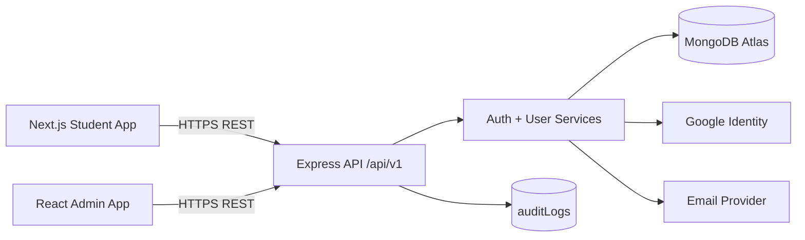

# DeepLearner API Design v1.0

**Status:** Implementation-ready baseline  
**Scope:** Authentication + Users domain  
**API style:** REST  
**Base URL:** `https://api.deeplearner.com/api/v1`  
**Backend:** Node.js + Express + TypeScript  
**Validation:** Zod  
**Database:** MongoDB Atlas + Mongoose  
**Parent documents:** DeepLearner PRD v1.0, System Architecture v1.0, Database Design v1.0

---

## 1. Purpose

This document defines the first production REST API contract for DeepLearner, focused on **Authentication and Users**. It establishes conventions that later API modules—learning catalog, concepts, visualizations, practice, progress, interview preparation, analytics, AI, media, and Admin content operations—must follow unless a later ADR explicitly overrides them.

The design is intentionally implementation-ready: endpoint contracts, request/response envelopes, validation rules, token/session behavior, middleware ordering, authorization rules, rate limits, error codes, audit events, model summaries, indexes, test cases, and acceptance criteria are defined here.

## 2. Locked Decisions

| Area | Decision |
|---|---|
| API version | `/api/v1` |
| Student/Public client | Next.js + TypeScript |
| Admin client | React + TypeScript + Vite |
| Backend | Node.js + Express + TypeScript modular monolith |
| API style | REST |
| Authentication | DeepLearner-managed email/password + Google sign-in |
| Password hashing | Argon2id |
| Access token | Short-lived, 15 minutes |
| Refresh token | 30 days, rotated on every refresh |
| Refresh storage | Raw token in HttpOnly cookie; only hash stored server-side |
| Session storage | MongoDB `sessions` collection, one record per login/device |
| Multiple devices | Allowed |
| Email verification | Required for email/password users before full access |
| Verification expiry | 15 minutes |
| Password reset expiry | 30 minutes |
| Public Admin signup | Not allowed |
| Roles | `STUDENT`, `ADMIN` |
| User statuses | `PENDING_VERIFICATION`, `ACTIVE`, `DISABLED`, `SUSPENDED` |
| Default stored plan | `FREE` |
| Development entitlements | All premium features may be enabled by environment policy |
| Email change | Not supported in V1 |
| Profile image | Not supported in V1 |
| Account deletion/deactivation | Not user-accessible in V1 |
| Security event storage | Reuse `auditLogs` |

## 3. API Design Principles

1. **REST resources and predictable HTTP semantics.**
2. **Backend authorization is authoritative.** A hidden UI control is never a security boundary.
3. **No secrets in browser-readable storage.** Refresh tokens use HttpOnly cookies; API keys never reach clients.
4. **Access tokens are short-lived.** Session revocation takes full effect after at most the access-token lifetime.
5. **Refresh tokens rotate.** Reuse of an old refresh secret revokes the corresponding session.
6. **Uniform response envelopes.** Clients can handle success, failure, pagination, and request IDs consistently.
7. **Validation at the API boundary.** Zod validates params, query strings, headers, and JSON bodies before business logic.
8. **Generic responses for account-recovery endpoints.** Avoid user enumeration.
9. **Idempotent behavior where security workflows require it.** Repeated logout/recovery requests should not leak account state.
10. **Versioning from day one.** Breaking changes require `/api/v2` or a documented compatible migration.

## 4. System Context



Both frontends use the same API. Admin-specific resources are namespaced under `/api/v1/admin/*` and protected by `ADMIN` authorization middleware.

## 5. Base URL and Environments

| Environment | Example API URL |
|---|---|
| Local | `http://localhost:4000/api/v1` |
| Development | `https://api-dev.deeplearner.com/api/v1` |
| Production | `https://api.deeplearner.com/api/v1` |

Production and development must use separate databases, secrets, Google credentials, email-provider credentials, and AI/provider secrets.

## 6. Transport and Content Rules

- Production traffic is HTTPS only.
- Request/response JSON uses `application/json; charset=utf-8`.
- JSON request bodies are size-limited. Default recommendation: **256 KB** for Auth/User APIs.
- Media uploads do not pass through these endpoints; S3 presigned uploads are handled by the Media module.
- Timestamps use ISO 8601 UTC strings, e.g. `2026-09-24T13:10:00.000Z`.
- MongoDB ObjectIds are exposed as opaque string IDs.
- Unknown request fields are rejected for security-sensitive endpoints.

## 7. Standard Headers

### Client request headers

```http
Content-Type: application/json
Authorization: Bearer <access-token>   # protected endpoints only
X-Request-Id: <optional-client-generated-id>
```

If `X-Request-Id` is absent, the API generates one.

### Response headers

```http
X-Request-Id: 9b47f0f8-...
Cache-Control: no-store               # authentication/user-sensitive responses
```

Authentication responses should not be cached by browsers or intermediary caches.

## 8. Standard Success Envelope

```json
{
  "success": true,
  "data": {},
  "message": "Login successful",
  "meta": {
    "requestId": "9b47f0f8-18d4-4cf0-b5e7-a2d88f8c3e8a"
  }
}
```

For list endpoints:

```json
{
  "success": true,
  "data": [],
  "message": null,
  "meta": {
    "page": 1,
    "limit": 20,
    "total": 137,
    "totalPages": 7,
    "requestId": "..."
  }
}
```

## 9. Standard Error Envelope

```json
{
  "success": false,
  "error": {
    "code": "AUTH_INVALID_CREDENTIALS",
    "message": "Invalid email or password"
  },
  "meta": {
    "requestId": "9b47f0f8-18d4-4cf0-b5e7-a2d88f8c3e8a"
  }
}
```

Validation errors may include safe field details:

```json
{
  "success": false,
  "error": {
    "code": "VALIDATION_ERROR",
    "message": "Request validation failed",
    "details": [
      { "field": "password", "message": "Must contain at least 10 characters" }
    ]
  },
  "meta": { "requestId": "..." }
}
```

Internal stack traces, database errors, token internals, provider responses, and secrets must never be returned to clients.

## 10. HTTP Status Standards

| Status | Use |
|---:|---|
| `200` | Successful read/update/action |
| `201` | Resource/account/session created |
| `202` | Accepted recovery/resend request where response is intentionally generic |
| `400` | Invalid request/token format/validation |
| `401` | Missing, invalid, or expired authentication credentials |
| `403` | Authenticated but not permitted; unverified/disabled/suspended states |
| `404` | Resource not found where revealing existence is safe |
| `409` | Duplicate email or invalid state transition/conflict |
| `429` | Rate limit exceeded |
| `500` | Unexpected server failure |
| `503` | Critical dependency temporarily unavailable |

## 11. Access Token Design

The access token is a signed JWT with a **15-minute lifetime**.

Recommended claims:

```json
{
  "sub": "<userId>",
  "sid": "<sessionId>",
  "role": "STUDENT",
  "iat": 1790250000,
  "exp": 1790250900,
  "jti": "<unique-token-id>"
}
```

Rules:

- Do not place email, profile data, plan entitlements, or sensitive personal data in the token unless strictly required.
- `role` may be included for routing convenience, but backend authorization may still load authoritative user/session state for sensitive operations.
- The browser keeps the access token **in memory**, not `localStorage` or `sessionStorage`.
- Access tokens are sent with `Authorization: Bearer ...`.

## 12. Refresh Token and Session Design

A refresh token is an opaque random secret associated with one MongoDB `sessions` document.

Recommended wire shape:

```text
<sessionId>.<randomSecret>
```

`sessionId` is not secret and allows efficient session lookup. Only a cryptographic hash of `randomSecret` is stored in MongoDB.

### Production cookie

```text
Name: __Host-dl_refresh
HttpOnly: true
Secure: true
SameSite: Lax
Path: /
Max-Age: 30 days
Domain: omitted (host-only to api.deeplearner.com)
```

Local development may use a non-prefixed cookie and `Secure=false` only on localhost.

### Rotation

Every successful `/auth/refresh` call:

1. Extracts `sessionId` and secret from the cookie.
2. Loads the session by `_id`.
3. Rejects expired/revoked sessions.
4. Hashes and compares the supplied secret with `refreshTokenHash`.
5. If it matches, generates a new random secret.
6. Atomically replaces `refreshTokenHash` and updates `lastUsedAt`.
7. Sets a new refresh cookie and returns a new access token.

### Reuse detection

If the session exists but the supplied secret does not match the current hash, the server treats it as possible replay/reuse:

- revoke that session,
- clear the refresh cookie,
- write `AUTH_REFRESH_REUSE_DETECTED` to `auditLogs`,
- return `401 AUTH_REFRESH_TOKEN_REUSED`.

Clients must serialize refresh requests to avoid racing two refresh calls for the same session.

## 13. CORS and CSRF Boundaries

Allowed production origins:

```text
https://deeplearner.com
https://admin.deeplearner.com
```

Rules:

- `Access-Control-Allow-Origin` must echo only a configured allowlisted origin; never `*` when credentials are enabled.
- `Access-Control-Allow-Credentials: true` is required for refresh-cookie requests.
- Auth cookie endpoints use `POST`, not `GET`.
- The API validates `Origin` for cookie-authenticated operations such as refresh/logout.
- `SameSite=Lax`, HTTPS, host-only cookies, exact-origin CORS, and Origin validation form the V1 CSRF defense for refresh/logout endpoints.

## 14. Password Rules

- Length: **10–128 characters**.
- No mandatory uppercase/symbol/number composition rule.
- Reject known trivial/commonly compromised passwords when practical.
- Hash using Argon2id with centrally configured parameters.
- Never log or return passwords or hashes.
- Password fields are never selected by default from Mongoose queries.

## 15. User Status Semantics

| Status | Meaning | Login behavior |
|---|---|---|
| `PENDING_VERIFICATION` | Email/password registration not verified | Credentials may be checked, but full login denied |
| `ACTIVE` | Normal account | Allowed |
| `DISABLED` | Indefinitely blocked by Admin | Denied |
| `SUSPENDED` | Temporarily blocked | Denied until lifted/expired |

If `SUSPENDED` has `suspendedUntil <= now`, the service may transition the account back to `ACTIVE` at the next authenticated/login operation.

## 16. Endpoint Catalog

| Method | Path | Auth | Purpose |
|---|---|---|---|
| POST | `/auth/register` | Public | Register email/password student |
| POST | `/auth/verify-email` | Public | Verify registration token |
| POST | `/auth/resend-verification` | Public | Send a new verification email |
| POST | `/auth/login` | Public | Email/password login |
| POST | `/auth/google` | Public | Google sign-in / verified-email account linking |
| POST | `/auth/refresh` | Refresh cookie | Rotate refresh token and return access token |
| POST | `/auth/logout` | Refresh cookie | Revoke current session |
| POST | `/auth/logout-all` | Access token | Revoke all sessions for current user |
| POST | `/auth/forgot-password` | Public | Start password reset |
| POST | `/auth/reset-password` | Public | Reset password using one-time token |
| POST | `/auth/change-password` | Access token | Change existing password |
| POST | `/auth/set-password` | Access token | Add password to Google-only account |
| GET | `/users/me` | Access token | Get current profile |
| PATCH | `/users/me` | Access token | Update allowed profile/onboarding fields |
| GET | `/admin/users` | ADMIN | Search/list users |
| GET | `/admin/users/:id` | ADMIN | View safe user details |
| PATCH | `/admin/users/:id/status` | ADMIN | Disable/enable/suspend/unsuspend |
| PATCH | `/admin/users/:id/plan` | ADMIN | Change FREE/PREMIUM plan |

There is intentionally **no email-change API** and no public Admin-registration API in V1.

---

# 17. Endpoint Contracts

## 17.1 Register Student

### `POST /api/v1/auth/register`

**Auth:** Public  
**Rate limit:** Recommended 5 requests/hour/IP  
**Success:** `201 Created`

### Request

```json
{
  "firstName": "Ashish",
  "lastName": "C",
  "email": "ashish@example.com",
  "password": "a-long-secure-password",
  "profile": {
    "experienceLevel": "INTERMEDIATE",
    "learningGoals": ["INTERVIEW_PREPARATION"],
    "interestedTechnologyIds": ["66f..."],
    "preferredDifficulty": "INTERMEDIATE",
    "dailyStudyGoalMinutes": 60
  }
}
```

`profile` is optional at registration and may be completed later through `/users/me`.

### Validation

- `firstName`: 1–80 characters.
- `lastName`: 1–80 characters.
- `email`: valid email; trim + lowercase before lookup/storage.
- `password`: 10–128 characters.
- `role`, `plan`, `status`, `emailVerifiedAt` are rejected if supplied.
- Public registration always creates `role=STUDENT`, `plan=FREE`, `status=PENDING_VERIFICATION`.

### Success response

```json
{
  "success": true,
  "data": {
    "userId": "66f123...",
    "email": "ashish@example.com",
    "status": "PENDING_VERIFICATION",
    "verificationRequired": true
  },
  "message": "Registration successful. Verify your email to continue.",
  "meta": { "requestId": "..." }
}
```

### Side effects

- Hash password using Argon2id.
- Create user.
- Invalidate any older verification tokens for this user.
- Create a 15-minute hashed verification token.
- Send verification email.
- Write `AUTH_REGISTERED` audit event.

### Errors

- `409 AUTH_EMAIL_ALREADY_EXISTS`
- `400 VALIDATION_ERROR`
- `429 RATE_LIMIT_EXCEEDED`

---

## 17.2 Verify Email

### `POST /api/v1/auth/verify-email`

**Auth:** Public  
**Success:** `200 OK`

### Request

```json
{ "token": "raw-token-from-email-link" }
```

### Behavior

1. Hash incoming token.
2. Find unused/unexpired `emailVerificationTokens` record.
3. Set `users.emailVerifiedAt`.
4. Change `PENDING_VERIFICATION -> ACTIVE`.
5. Delete/consume all verification tokens for the user.
6. Audit `AUTH_EMAIL_VERIFIED`.

### Response

```json
{
  "success": true,
  "data": { "verified": true },
  "message": "Email verified successfully",
  "meta": { "requestId": "..." }
}
```

### Errors

- `400 AUTH_VERIFICATION_TOKEN_INVALID_OR_EXPIRED`

Repeated verification may return a safe `200` when the user is already verified if the token can be safely associated; otherwise use the generic invalid/expired response.

---

## 17.3 Resend Verification

### `POST /api/v1/auth/resend-verification`

**Auth:** Public  
**Rate limit:** Recommended 3/hour/email+IP  
**Success:** `202 Accepted`

### Request

```json
{ "email": "ashish@example.com" }
```

### Response

Always generic:

```json
{
  "success": true,
  "data": null,
  "message": "If the account requires verification, a new verification email has been sent.",
  "meta": { "requestId": "..." }
}
```

Do not reveal whether the email exists or is already verified.

---

## 17.4 Email/Password Login

### `POST /api/v1/auth/login`

**Auth:** Public  
**Rate limit:** Recommended 5 failed attempts/15 minutes per normalized-email + IP combination  
**Success:** `200 OK`

### Request

```json
{
  "email": "ashish@example.com",
  "password": "a-long-secure-password"
}
```

### Behavior

1. Normalize email.
2. Load user including `passwordHash` explicitly.
3. Perform constant-cost password verification strategy where practical.
4. Reject invalid credentials with the same generic error.
5. Check account status.
6. Require verified email for credential users.
7. Create a session with 30-day expiry.
8. Set refresh cookie.
9. Return 15-minute access token.
10. Update safe login metadata and audit success.

### Response

```json
{
  "success": true,
  "data": {
    "accessToken": "eyJ...",
    "expiresInSeconds": 900,
    "user": {
      "id": "66f123...",
      "firstName": "Ashish",
      "lastName": "C",
      "email": "ashish@example.com",
      "role": "STUDENT",
      "plan": "FREE",
      "status": "ACTIVE"
    }
  },
  "message": "Login successful",
  "meta": { "requestId": "..." }
}
```

The refresh token is **never** returned in JSON.

### Errors

- `401 AUTH_INVALID_CREDENTIALS`
- `403 AUTH_EMAIL_NOT_VERIFIED`
- `403 AUTH_ACCOUNT_DISABLED`
- `403 AUTH_ACCOUNT_SUSPENDED`
- `429 RATE_LIMIT_EXCEEDED`

---

## 17.5 Google Login / Account Linking

### `POST /api/v1/auth/google`

**Auth:** Public  
**Success:** `200 OK` for existing account, `201 Created` for new account

V1 uses the Google Identity Services credential flow because DeepLearner only needs identity, not Google API scopes.

### Request

```json
{
  "credential": "<google-id-token>"
}
```

### Behavior

1. Verify the Google credential using the supported Google server library.
2. Verify issuer, audience, signature, expiration, and nonce/state where applicable.
3. Require `email_verified=true`.
4. Normalize Google email.
5. Find user by linked provider ID; otherwise by globally unique email.
6. If matching email/password user exists, append Google provider identity; do not create a duplicate account.
7. If no user exists, create `STUDENT`, `FREE`, `ACTIVE` account with `emailVerifiedAt=now` and no password hash.
8. Create DeepLearner session and issue normal DeepLearner access/refresh tokens.
9. Audit `AUTH_GOOGLE_LOGIN` and `AUTH_PROVIDER_LINKED` when linking occurs.

Google tokens are not used as DeepLearner session tokens.

### Errors

- `401 AUTH_GOOGLE_CREDENTIAL_INVALID`
- `403 AUTH_GOOGLE_EMAIL_NOT_VERIFIED`
- `403 AUTH_ACCOUNT_DISABLED`
- `403 AUTH_ACCOUNT_SUSPENDED`

---

## 17.6 Refresh Access Token

### `POST /api/v1/auth/refresh`

**Auth:** Refresh cookie  
**Success:** `200 OK`

### Request

No JSON body required.

```http
Cookie: __Host-dl_refresh=<sessionId>.<secret>
Origin: https://deeplearner.com
```

### Response

```json
{
  "success": true,
  "data": {
    "accessToken": "eyJ...",
    "expiresInSeconds": 900
  },
  "message": null,
  "meta": { "requestId": "..." }
}
```

A new refresh cookie is set on every success.

### Errors

- `401 AUTH_REFRESH_TOKEN_MISSING`
- `401 AUTH_REFRESH_TOKEN_INVALID`
- `401 AUTH_REFRESH_TOKEN_EXPIRED`
- `401 AUTH_REFRESH_TOKEN_REUSED`
- `403 AUTH_ACCOUNT_DISABLED`
- `403 AUTH_ACCOUNT_SUSPENDED`

---

## 17.7 Logout Current Session

### `POST /api/v1/auth/logout`

**Auth:** Refresh cookie  
**Success:** `200 OK`

Behavior:

- Resolve current session when possible.
- Mark it revoked.
- Clear refresh cookie.
- Audit `AUTH_LOGOUT`.

The endpoint is intentionally idempotent: missing/already-revoked cookies still return success.

```json
{
  "success": true,
  "data": null,
  "message": "Logged out",
  "meta": { "requestId": "..." }
}
```

---

## 17.8 Logout All Devices

### `POST /api/v1/auth/logout-all`

**Auth:** Access token  
**Success:** `200 OK`

Behavior:

- Revoke all active sessions for `req.user.id`.
- Clear current refresh cookie.
- Audit `AUTH_LOGOUT_ALL`.

```json
{
  "success": true,
  "data": { "revokedSessions": 3 },
  "message": "Logged out from all devices",
  "meta": { "requestId": "..." }
}
```

---

## 17.9 Forgot Password

### `POST /api/v1/auth/forgot-password`

**Auth:** Public  
**Rate limit:** Recommended 3/hour/email+IP  
**Success:** `202 Accepted`

### Request

```json
{ "email": "ashish@example.com" }
```

### Response

Always generic:

```json
{
  "success": true,
  "data": null,
  "message": "If the account can reset its password, reset instructions have been sent.",
  "meta": { "requestId": "..." }
}
```

For an eligible user, invalidate existing reset tokens and create a new **30-minute** hashed token.

---

## 17.10 Reset Password

### `POST /api/v1/auth/reset-password`

**Auth:** Public + reset token  
**Success:** `200 OK`

### Request

```json
{
  "token": "raw-reset-token",
  "newPassword": "another-long-secure-password"
}
```

### Behavior

- Validate one-time reset token.
- Hash new password using Argon2id.
- Set/replace `passwordHash`.
- Ensure email/password provider capability is present.
- Consume all outstanding reset tokens.
- Revoke **all existing sessions**.
- Audit `AUTH_PASSWORD_RESET`.

### Errors

- `400 AUTH_RESET_TOKEN_INVALID_OR_EXPIRED`
- `400 AUTH_PASSWORD_POLICY_FAILED`

---

## 17.11 Change Password

### `POST /api/v1/auth/change-password`

**Auth:** Access token  
**Success:** `200 OK`

### Request

```json
{
  "currentPassword": "current-password",
  "newPassword": "new-long-secure-password"
}
```

### Behavior

- Requires an existing password hash.
- Verify current password.
- Reject reusing the exact current password.
- Save new Argon2id hash.
- Revoke all sessions except the current session, or rotate the current session as part of the operation.
- Audit `AUTH_PASSWORD_CHANGED`.

### Errors

- `400 AUTH_PASSWORD_NOT_CONFIGURED`
- `401 AUTH_CURRENT_PASSWORD_INVALID`
- `400 AUTH_PASSWORD_POLICY_FAILED`

---

## 17.12 Set Password for Google-Only Account

### `POST /api/v1/auth/set-password`

**Auth:** Access token  
**Success:** `200 OK`

This endpoint is required to support the approved behavior: a user who first joined with Google can later add email/password login.

### Request

```json
{ "newPassword": "new-long-secure-password" }
```

### Rules

- User must have a verified email.
- `passwordHash` must currently be null/absent.
- Set Argon2id hash.
- Audit `AUTH_PASSWORD_ADDED`.

### Errors

- `409 AUTH_PASSWORD_ALREADY_CONFIGURED`
- `403 AUTH_EMAIL_NOT_VERIFIED`
- `400 AUTH_PASSWORD_POLICY_FAILED`

---

## 17.13 Get Current User

### `GET /api/v1/users/me`

**Auth:** Access token  
**Success:** `200 OK`

### Response

```json
{
  "success": true,
  "data": {
    "id": "66f123...",
    "firstName": "Ashish",
    "lastName": "C",
    "email": "ashish@example.com",
    "emailVerified": true,
    "role": "STUDENT",
    "plan": "FREE",
    "status": "ACTIVE",
    "authMethods": ["PASSWORD", "GOOGLE"],
    "profile": {
      "experienceLevel": "INTERMEDIATE",
      "learningGoals": ["INTERVIEW_PREPARATION"],
      "interestedTechnologyIds": ["66f..."],
      "preferredDifficulty": "INTERMEDIATE",
      "dailyStudyGoalMinutes": 60
    },
    "createdAt": "2026-09-24T10:00:00.000Z"
  },
  "message": null,
  "meta": { "requestId": "..." }
}
```

Sensitive values such as `passwordHash`, provider subject IDs, token hashes, and audit internals are never returned.

---

## 17.14 Update Current User

### `PATCH /api/v1/users/me`

**Auth:** Access token  
**Success:** `200 OK`

### Allowed request

```json
{
  "firstName": "Ashish",
  "lastName": "C",
  "profile": {
    "experienceLevel": "ADVANCED",
    "learningGoals": ["INTERVIEW_PREPARATION", "MASTER_TECHNOLOGY"],
    "interestedTechnologyIds": ["66f...", "66a..."],
    "preferredDifficulty": "ADVANCED",
    "dailyStudyGoalMinutes": 90
  }
}
```

### Forbidden fields

The API rejects attempts to directly change:

```text
email
role
plan
status
emailVerifiedAt
passwordHash
authProviders
createdAt
```

There is no email-change feature in V1.

---

## 17.15 Admin List/Search Users

### `GET /api/v1/admin/users`

**Auth:** Access token + `ADMIN`  
**Success:** `200 OK`

### Query parameters

| Parameter | Default | Rules |
|---|---:|---|
| `page` | `1` | integer >= 1 |
| `limit` | `20` | 1–100 |
| `search` | - | safe substring/prefix search on name/email |
| `status` | - | allowed user status |
| `plan` | - | `FREE` / `PREMIUM` |
| `role` | - | `STUDENT` / `ADMIN` |
| `sortBy` | `createdAt` | allowlist only |
| `sortOrder` | `desc` | `asc` / `desc` |

Example:

```http
GET /api/v1/admin/users?page=1&limit=20&status=ACTIVE&search=ashish&sortBy=createdAt&sortOrder=desc
```

### Response item

```json
{
  "id": "66f123...",
  "firstName": "Ashish",
  "lastName": "C",
  "email": "ashish@example.com",
  "role": "STUDENT",
  "plan": "FREE",
  "status": "ACTIVE",
  "emailVerified": true,
  "lastLoginAt": "2026-09-24T12:00:00.000Z",
  "createdAt": "2026-09-01T08:00:00.000Z"
}
```

---

## 17.16 Admin Get User

### `GET /api/v1/admin/users/:id`

**Auth:** `ADMIN`  
**Success:** `200 OK`

Returns safe operational user details and may include:

- profile/onboarding,
- authentication method names,
- verification state,
- account status,
- suspension metadata,
- plan,
- active session count,
- created/updated/last login timestamps.

It must not expose password hashes, refresh-token hashes, raw provider tokens, or security secrets.

Errors:

- `404 USER_NOT_FOUND`
- `400 VALIDATION_ERROR` for malformed ObjectId

---

## 17.17 Admin Change User Status

### `PATCH /api/v1/admin/users/:id/status`

**Auth:** `ADMIN`  
**Success:** `200 OK`

### Disable

```json
{
  "status": "DISABLED",
  "reason": "Terms violation"
}
```

### Suspend

```json
{
  "status": "SUSPENDED",
  "reason": "Temporary security review",
  "suspendedUntil": "2026-10-01T00:00:00.000Z"
}
```

### Re-enable

```json
{
  "status": "ACTIVE",
  "reason": "Review completed"
}
```

Rules:

- `reason` is required for `DISABLED` and `SUSPENDED`.
- `suspendedUntil` is optional but must be future time when provided.
- Public/Admin APIs do not manually set `PENDING_VERIFICATION`; it is system-managed.
- Admin cannot disable/suspend their own account through this endpoint.
- Disabling/suspending a user revokes all active sessions.
- Audit old state, new state, reason, actor, and target.

Errors:

- `409 USER_INVALID_STATUS_TRANSITION`
- `409 ADMIN_SELF_STATUS_CHANGE_NOT_ALLOWED`
- `404 USER_NOT_FOUND`

---

## 17.18 Admin Change User Plan

### `PATCH /api/v1/admin/users/:id/plan`

**Auth:** `ADMIN`  
**Success:** `200 OK`

### Request

```json
{
  "plan": "PREMIUM",
  "reason": "Development testing"
}
```

Rules:

- Allowed values: `FREE`, `PREMIUM`.
- Plan does not directly encode every feature; entitlement service resolves effective access.
- In development, an environment-level policy may grant premium entitlements even when stored plan remains `FREE`.
- Audit plan change.

---

# 18. API Pagination, Filtering and Sorting

V1 uses page-based pagination because expected scale is approximately 1,000 initial users and Admin pages benefit from page numbers.

Standard parameters:

```text
page=1
limit=20
sortBy=createdAt
sortOrder=desc
```

Rules:

- `limit` max = 100.
- Sort fields must be allowlisted per endpoint to prevent arbitrary database field access.
- Filters are validated enums/typed values.
- If scale later makes deep offsets inefficient, list APIs may migrate to cursor pagination in a backward-compatible version.

# 19. Middleware Pipelines

## Public credential endpoint

```text
requestId
  -> securityHeaders
  -> CORS/origin policy
  -> bodySizeLimit
  -> rateLimit
  -> Zod validation
  -> controller
  -> service
  -> repository
  -> audit where applicable
  -> response mapper
  -> error handler
```

## Protected Student endpoint

```text
requestId
  -> CORS
  -> authenticateAccessToken
  -> load/check user status
  -> Zod validation
  -> controller/service
  -> response
```

## Protected Admin endpoint

```text
requestId
  -> CORS
  -> authenticateAccessToken
  -> requireActiveUser
  -> requireRole(ADMIN)
  -> rateLimit
  -> Zod validation
  -> controller/service
  -> audit mutation
  -> response
```

# 20. Rate-Limit Baseline

Thresholds are configuration, not hard-coded business logic.

| Endpoint/group | Initial recommendation |
|---|---|
| Register | 5/hour/IP |
| Login failures | 5/15 min/email+IP |
| Google login | 10/15 min/IP |
| Resend verification | 3/hour/email+IP |
| Forgot password | 3/hour/email+IP |
| Verify/reset token attempts | 10/15 min/IP |
| Refresh | 60/15 min/session/IP |
| Admin read APIs | 120/min/admin |
| Admin mutations | 60/min/admin |

With one API instance, a process-local limiter is acceptable for early development. Before multi-instance production deployment, rate limits requiring global accuracy should move to a shared/edge-backed limiter without changing endpoint contracts.

# 21. Error Code Catalog

| Code | HTTP | Meaning |
|---|---:|---|
| `VALIDATION_ERROR` | 400 | Request failed schema validation |
| `AUTH_EMAIL_ALREADY_EXISTS` | 409 | Registration email already exists |
| `AUTH_INVALID_CREDENTIALS` | 401 | Email/password invalid |
| `AUTH_EMAIL_NOT_VERIFIED` | 403 | Credential account not verified |
| `AUTH_ACCOUNT_DISABLED` | 403 | Account disabled |
| `AUTH_ACCOUNT_SUSPENDED` | 403 | Account suspended |
| `AUTH_ACCESS_TOKEN_MISSING` | 401 | Bearer token missing |
| `AUTH_ACCESS_TOKEN_INVALID` | 401 | Bearer token invalid |
| `AUTH_ACCESS_TOKEN_EXPIRED` | 401 | Bearer token expired |
| `AUTH_REFRESH_TOKEN_MISSING` | 401 | Refresh cookie missing |
| `AUTH_REFRESH_TOKEN_INVALID` | 401 | Refresh token invalid |
| `AUTH_REFRESH_TOKEN_EXPIRED` | 401 | Session/token expired |
| `AUTH_REFRESH_TOKEN_REUSED` | 401 | Old/mismatched refresh secret detected |
| `AUTH_VERIFICATION_TOKEN_INVALID_OR_EXPIRED` | 400 | Verification token unusable |
| `AUTH_RESET_TOKEN_INVALID_OR_EXPIRED` | 400 | Reset token unusable |
| `AUTH_PASSWORD_POLICY_FAILED` | 400 | Password does not meet policy |
| `AUTH_CURRENT_PASSWORD_INVALID` | 401 | Current password wrong |
| `AUTH_PASSWORD_NOT_CONFIGURED` | 400 | Change password called on Google-only account |
| `AUTH_PASSWORD_ALREADY_CONFIGURED` | 409 | Set-password called when password exists |
| `AUTH_GOOGLE_CREDENTIAL_INVALID` | 401 | Google credential cannot be verified |
| `AUTH_GOOGLE_EMAIL_NOT_VERIFIED` | 403 | Google identity email not verified |
| `AUTH_FORBIDDEN` | 403 | Role/permission denied |
| `USER_NOT_FOUND` | 404 | User does not exist |
| `USER_INVALID_STATUS_TRANSITION` | 409 | Requested state transition invalid |
| `ADMIN_SELF_STATUS_CHANGE_NOT_ALLOWED` | 409 | Admin tried to disable/suspend own account |
| `RATE_LIMIT_EXCEEDED` | 429 | Request threshold exceeded |
| `DEPENDENCY_UNAVAILABLE` | 503 | Required external provider unavailable |
| `INTERNAL_ERROR` | 500 | Unexpected server error |

# 22. Enumeration-Resistance Rules

The following endpoints return generic messages regardless of whether an email exists:

- `/auth/forgot-password`
- `/auth/resend-verification`

Login returns `AUTH_INVALID_CREDENTIALS` for both unknown email and wrong password.

Registration may return `AUTH_EMAIL_ALREADY_EXISTS` because the user is explicitly attempting to claim an email. If product requirements later demand stronger anti-enumeration, the registration UX may be changed without altering stored data.

# 23. Google Account Linking Rules

1. DeepLearner email uniqueness is global across providers.
2. Google identity is accepted only when the Google credential is verified and `email_verified=true`.
3. Existing provider ID match -> login existing user.
4. No provider match but verified Google email matches existing DeepLearner user -> link Google to that user.
5. No existing email -> create new Google-backed student account.
6. Never link accounts based on an unverified external email.
7. Never overwrite an existing DeepLearner user's name/profile automatically during repeated Google logins.
8. Provider subject IDs are stored internally but not returned to clients.

# 24. Mongoose Model Summary

## `users`

Recommended fields:

```text
_id
firstName
lastName
email
passwordHash?                 # select: false
role                           STUDENT | ADMIN
plan                           FREE | PREMIUM
status                         PENDING_VERIFICATION | ACTIVE | DISABLED | SUSPENDED
emailVerifiedAt?
suspendedUntil?
suspensionReason?
authProviders[]                provider + providerUserId
profile {
  experienceLevel?
  learningGoals[]
  interestedTechnologyIds[]
  preferredDifficulty?
  dailyStudyGoalMinutes?
}
lastLoginAt?
createdAt
updatedAt
```

Recommended indexes:

```text
unique { email: 1 }
{ status: 1, createdAt: -1 }
{ plan: 1, createdAt: -1 }
{ role: 1, createdAt: -1 }
```

A normalized/search helper field may be added if Admin name/email search requires more efficient prefix search.

## `sessions`

```text
_id
userId
refreshTokenHash
expiresAt
revokedAt?
revocationReason?
deviceInfo?
ipHash?
createdAt
lastUsedAt
```

Indexes:

```text
{ userId: 1, revokedAt: 1 }
TTL { expiresAt: 1 }
```

## `emailVerificationTokens`

```text
_id
userId
tokenHash
expiresAt
createdAt
```

Indexes:

```text
unique { tokenHash: 1 }
{ userId: 1 }
TTL { expiresAt: 1 }
```

## `passwordResetTokens`

Same pattern as verification tokens; TTL on `expiresAt`.

### Database Design alignment note

The Database Design v1.0 `users.status` field should be interpreted/updated to support the finalized API states:

```text
PENDING_VERIFICATION | ACTIVE | DISABLED | SUSPENDED
```

and the email verification expiry is finalized as **15 minutes**.

# 25. Audit Events

Auth/User events reuse `auditLogs` with `category="AUTH"` or `category="USER_ADMIN"`.

Recommended event names:

```text
AUTH_REGISTERED
AUTH_EMAIL_VERIFICATION_SENT
AUTH_EMAIL_VERIFIED
AUTH_LOGIN_SUCCESS
AUTH_LOGIN_FAILED
AUTH_GOOGLE_LOGIN
AUTH_PROVIDER_LINKED
AUTH_REFRESH_SUCCESS
AUTH_REFRESH_REUSE_DETECTED
AUTH_LOGOUT
AUTH_LOGOUT_ALL
AUTH_PASSWORD_RESET_REQUESTED
AUTH_PASSWORD_RESET
AUTH_PASSWORD_CHANGED
AUTH_PASSWORD_ADDED
USER_PROFILE_UPDATED
ADMIN_USER_STATUS_CHANGED
ADMIN_USER_PLAN_CHANGED
```

Audit logs must never contain raw passwords, reset/verification tokens, refresh secrets, access tokens, Google credentials, or secret headers.

# 26. Transaction and Atomicity Rules

Most auth operations use single-document atomic updates plus carefully ordered writes.

Recommended transaction use:

- Email verification: update user + consume tokens when strict all-or-nothing behavior is desired.
- Password reset: update password + revoke sessions + consume reset tokens. A transaction is recommended because these security changes should commit together.
- Admin disable/suspend: update status + revoke sessions. Transaction recommended.

Refresh-token rotation should use an atomic compare-and-update on the current session token hash to prevent concurrent refresh success.

# 27. Idempotency and Concurrency

- `logout` is idempotent.
- Recovery/resend endpoints are effectively idempotent from the caller's perspective.
- Email verification tokens are one-time-use.
- Password reset tokens are one-time-use.
- Refresh is **not** safely retryable with the same token after a successful rotation. Client refresh calls must be serialized.
- Admin status/plan updates should compare the latest resource state and return `409` for impossible transitions.

A general `Idempotency-Key` header is not required for Auth/User V1. It may be introduced later for payment or expensive AI/content mutation APIs.

# 28. Security Requirements

- Argon2id password hashing.
- No raw refresh/reset/verification token stored in MongoDB.
- Exact CORS origin allowlist.
- HttpOnly/Secure refresh cookie in production.
- Short-lived access JWT.
- Refresh rotation and replay detection.
- Authentication and Admin mutation rate limiting.
- Zod strict validation.
- Mongoose sensitive fields excluded by default.
- No account existence leakage on recovery/resend.
- Admin authorization enforced by backend middleware.
- Access/refresh/provider tokens excluded from logs.
- HTTPS only in production.
- Response security headers configured through the backend/reverse proxy.
- Login failures use generic messages.

# 29. Logging and Observability

Every request log should contain safe operational metadata:

```json
{
  "requestId": "...",
  "method": "POST",
  "path": "/api/v1/auth/login",
  "status": 200,
  "durationMs": 148,
  "userId": "66f...",
  "sessionId": "66a..."
}
```

Sensitive bodies/headers must be redacted.

Recommended metrics:

- login success/failure count,
- verification sends/completions,
- password reset requests/completions,
- refresh success/failure/reuse,
- rate-limit rejections,
- Google-auth failures,
- active session count,
- Admin user-status changes,
- endpoint p50/p95 latency and 5xx rate.

# 30. Testing Strategy

## Unit tests

- Email normalization.
- Password policy.
- Argon2 service wrapper.
- JWT issue/verify.
- Refresh secret generation/hash/compare.
- Status-transition rules.
- Admin plan/status authorization.
- Zod schemas.

## Integration tests

- Register -> verification token created.
- Verify -> status becomes ACTIVE.
- Login -> session created + refresh cookie + access token.
- Refresh -> old secret invalid, new secret valid.
- Reuse old refresh -> session revoked.
- Logout -> session revoked and cookie cleared.
- Logout all -> all user sessions revoked.
- Forgot/reset -> password changes + sessions revoked.
- Google new user creation.
- Google links verified existing email.
- Google unverified email rejected.
- User cannot patch email/role/plan/status.
- Student cannot call `/admin/*`.
- Disabled/suspended user cannot authenticate/refresh.
- Admin disable revokes sessions.

## Security tests

- Brute-force/rate-limit behavior.
- Token replay.
- Expired JWT.
- Expired verification/reset token.
- Malformed ObjectId.
- Unknown JSON fields.
- CORS from unapproved origin.
- Cookie endpoints from unapproved Origin.
- SQL/NoSQL operator injection payloads rejected by strict validation.
- Sensitive field exposure tests.
- Generic account-recovery responses.

# 31. Acceptance Criteria

Authentication + Users API V1 is complete when:

1. A student can register with email/password.
2. Registration never creates an Admin.
3. Verification expires after 15 minutes and can be resent safely.
4. Unverified credential accounts cannot obtain a normal authenticated session.
5. Email/password login creates a 15-minute access token and 30-day refresh-backed session.
6. Multiple sessions/devices work independently.
7. Refresh tokens rotate and replay causes session revocation.
8. Current-device and all-device logout work.
9. Password reset expires after 30 minutes and revokes all sessions.
10. Password change revokes other sessions.
11. Google sign-in verifies Google identity and links only verified matching email.
12. Google-only users can add a password through `/auth/set-password`.
13. `/users/me` never permits email, role, plan, status, or verification-state mutation.
14. Admin can search/view users, change status, and change plan.
15. Admin cannot create an Admin through public registration or change user role through these APIs.
16. Disabled/suspended accounts are denied access and sessions are revoked.
17. All protected routes enforce backend authentication/authorization.
18. Recovery APIs do not reveal account existence.
19. Standard envelopes and error codes are used consistently.
20. Audit logs capture defined security/Admin events without secrets.

# 32. Deferred API Modules

After this Authentication + Users contract is implemented, extend the same conventions in this order:

```text
1. Technology / Learning Path / Module / Topic
2. Concepts + publishing workflow
3. Visualizations
4. Practice Questions + Attempts
5. Student Progress
6. Notes / Bookmarks / Highlights
7. Interview Preparation
8. Gamification + Notifications
9. Media / S3 presigned uploads
10. AI generation + approvals
11. Analytics / Content Reports / Audit administration
```

Each module should reuse the response envelope, validation approach, request IDs, REST versioning, Admin authorization pattern, and error-code conventions defined in this document.

# 33. Recommended Initial Route Layout

```text
src/modules/auth/
  auth.routes.ts
  auth.controller.ts
  auth.service.ts
  auth.repository.ts
  auth.schemas.ts
  auth.errors.ts
  token.service.ts
  password.service.ts
  google-auth.service.ts

src/modules/users/
  user.routes.ts
  user.controller.ts
  user.service.ts
  user.repository.ts
  user.schemas.ts
  user.model.ts

src/modules/admin/users/
  admin-user.routes.ts
  admin-user.controller.ts
  admin-user.service.ts
  admin-user.schemas.ts

src/models/
  session.model.ts
  email-verification-token.model.ts
  password-reset-token.model.ts

src/middleware/
  authenticate.ts
  require-role.ts
  require-active-user.ts
  validate.ts
  rate-limit.ts
  request-id.ts
  error-handler.ts
```

The exact physical folder placement may evolve, but domain ownership and dependency direction should remain clear: **route -> controller -> service -> repository/model**, with security/provider helpers behind services.

---

## API Design v1.0 Status

**Authentication + Users contract: READY FOR IMPLEMENTATION**

The next API-design discussion should cover **Technology -> Learning Path -> Module -> Topic**, because that hierarchy becomes the foundation for Concept, Practice, Visualization, Progress, Search, and Admin content-management APIs.
