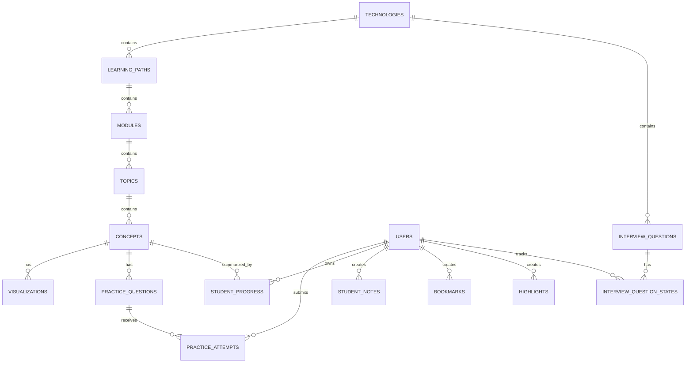

# DeepLearner Database Design v1.0

**Status:** Implementation-ready baseline  
**Database:** MongoDB Atlas (managed MongoDB)  
**ODM:** Mongoose + TypeScript  
**Primary application architecture:** Node.js/Express modular monolith with Next.js student app and React admin app  
**Target initial scale:** ~1,000 users

## 1. Purpose
This document defines the MongoDB data model for DeepLearner. It turns the approved PRD and System Architecture into concrete collection boundaries, relationships, indexing rules, security conventions, lifecycle rules, and transaction boundaries. The design intentionally favors a balanced MongoDB model: reference independently growing data; embed bounded editorial data that belongs to a single aggregate.

## 2. Locked Design Principles
- One MongoDB Atlas database per environment; development and production data are isolated.
- Use MongoDB ObjectId internally and human-readable slugs for public URLs.
- Concept is the central educational unit.
- Use references for hierarchy, visualizations, questions, attempts, progress, user-generated data and operational logs.
- Embed bounded Read/Example/Revise/source/completion data inside concepts.
- Keep one studentProgress document per user + concept; derive higher-level percentages initially.
- Store every practice attempt as an immutable record; never overwrite the first score.
- Use limited denormalization of hierarchy IDs for common queries, but never duplicate full parent documents.
- Use TTL indexes for verification/reset/session expiry data.
- Store refresh tokens and one-time tokens only as hashes.
- Store media bytes in S3; MongoDB stores metadata only.
- Use append-only audit and analytics event collections.
- Use MongoDB transactions only for multi-document invariants that must commit together.
- Use schemaVersion on complex documents such as concepts and visualizations.
- Archive published content; use soft deletion for operational records where deletion is necessary.

## 3. High-Level Relationship Model


## 4. Collection Catalog
| Domain | Collection | Responsibility |
|---|---|---|
| Identity & access | `users` | Primary user profile, role, plan and linked auth providers. |
| Identity & access | `sessions` | Refresh-token-backed login sessions and revocation state. |
| Identity & access | `emailVerificationTokens` | Short-lived hashed email verification tokens. |
| Identity & access | `passwordResetTokens` | Short-lived hashed password reset tokens. |
| Learning catalog | `technologies` | Top-level technology catalog such as JavaScript, React and Docker. |
| Learning catalog | `learningPaths` | Ordered learning journeys within a technology. |
| Learning catalog | `modules` | Ordered sections inside a learning path. |
| Learning catalog | `topics` | Ordered topics inside a module. |
| Learning catalog | `concepts` | Central educational unit: Read, Example, Revise, source and completion rules. |
| Learning content | `visualizations` | Visualization definitions, execution steps, nodes/edges and asset references. |
| Learning content | `practiceQuestions` | Coding, output, descriptive and scenario questions. |
| Learning content | `interviewQuestions` | Dedicated interview Q&A content. |
| Student learning | `practiceAttempts` | Immutable submitted practice attempts. |
| Student learning | `studentProgress` | One summarized progress document per student + concept. |
| Student learning | `studentNotes` | Private concept-linked notes. |
| Student learning | `bookmarks` | Polymorphic bookmarks for concepts/topics/interview questions. |
| Student learning | `highlights` | Private text/content highlights tied to concepts. |
| Student learning | `interviewQuestionStates` | Know / Need Revision / Important state per student/question. |
| Student learning | `studySessions` | Study-time sessions for dashboard and aggregate analytics. |
| Gamification | `badges` | Badge definitions. |
| Gamification | `studentBadges` | Awarded badges per student. |
| Communication | `notifications` | In-app notifications per student. |
| Content operations | `contentReports` | Student reports for incorrect/outdated/broken content. |
| Content operations | `contentApprovals` | Review/approval actions for publishable content. |
| Content operations | `aiGenerations` | AI generation metadata, usage, status and output references. |
| Content operations | `mediaAssets` | Metadata for files stored in AWS S3. |
| Operations | `auditLogs` | Append-only Admin/security audit trail. |
| Operations | `analyticsEvents` | Append-only learning/product events for aggregate analytics. |
| Commercial (future-ready) | `subscriptions` | Optional future subscription/payment state; dormant during development. |

## 5. Content Hierarchy
```text
Technology → LearningPath → Module → Topic → Concept
```
Each hierarchy level is a separate collection. Parent-child relationships use ObjectId references, while frequently queried ancestor IDs may also be copied into descendants as limited denormalization. Ordering is stored on the child document (`order`).

### Content payload recommendation
For V1, store textual technical content as sanitized **Markdown** rather than raw HTML. This supports code fences, lists, callouts and links while keeping rendering controlled. If a richer block editor becomes necessary later, migrate using `schemaVersion` rather than mixing unversioned payload shapes.

## 6. Major Collection Schemas
### `users`
| Field | Type | Required | Purpose |
|---|---|---:|---|
| `_id` | `ObjectId` | Yes | MongoDB primary key. |
| `email` | `string` | Yes | Normalized lowercase email; unique. |
| `passwordHash` | `string | null` | Conditional | Argon2id hash for credential users; null for Google-only accounts. |
| `displayName` | `string` | Yes | Student/Admin display name. |
| `role` | `STUDENT | ADMIN` | Yes | Authorization role. |
| `plan` | `FREE | PREMIUM` | Yes | Commercial plan marker; development defaults may grant all entitlements. |
| `status` | `ACTIVE | DISABLED` | Yes | Account operational state. |
| `emailVerifiedAt` | `date | null` | No | Set after credential email verification; Google users may be treated verified. |
| `authProviders` | `array<object>` | Yes | Linked providers such as {provider, providerUserId}. |
| `onboarding` | `object` | No | Technologies, level, goal, preferred difficulty, daily target. |
| `createdAt / updatedAt` | `date` | Yes | Audit timestamps. |

### `sessions`
| Field | Type | Required | Purpose |
|---|---|---:|---|
| `_id` | `ObjectId` | Yes | Session id. |
| `userId` | `ObjectId` | Yes | Reference to users. |
| `refreshTokenHash` | `string` | Yes | Hash only; never store raw refresh token. |
| `deviceInfo` | `object` | No | User agent / device label; avoid excessive fingerprinting. |
| `ipHash` | `string | null` | No | Optional privacy-preserving operational signal. |
| `expiresAt` | `date` | Yes | TTL expiration target. |
| `revokedAt` | `date | null` | No | Revocation timestamp. |
| `createdAt / lastUsedAt` | `date` | Yes | Session lifecycle timestamps. |

### `technologies`
| Field | Type | Required | Purpose |
|---|---|---:|---|
| `_id` | `ObjectId` | Yes | Primary key. |
| `name` | `string` | Yes | e.g., JavaScript. |
| `slug` | `string` | Yes | Globally unique public URL slug. |
| `description` | `string` | No | Catalog summary. |
| `iconAssetId` | `ObjectId | null` | No | Reference to mediaAssets. |
| `status` | `DRAFT | PUBLISHED | ARCHIVED` | Yes | Catalog publishing state. |
| `order` | `number` | Yes | Display order. |
| `createdBy / updatedBy` | `ObjectId` | Yes | Admin references. |
| `createdAt / updatedAt` | `date` | Yes | Audit timestamps. |

### `learningPaths`
| Field | Type | Required | Purpose |
|---|---|---:|---|
| `_id` | `ObjectId` | Yes | Primary key. |
| `technologyId` | `ObjectId` | Yes | Parent technology. |
| `title` | `string` | Yes | Learning path title. |
| `slug` | `string` | Yes | Unique within technology. |
| `description` | `string` | No | Path summary. |
| `targetLevel` | `string` | No | Beginner/intermediate/advanced. |
| `completionScore` | `number` | Yes | Default minimum percentage; typically 70. |
| `status` | `DRAFT | PUBLISHED | ARCHIVED` | Yes | Publishing state. |
| `order` | `number` | Yes | Display order. |
| `createdBy / updatedBy` | `ObjectId` | Yes | Admin references. |
| `createdAt / updatedAt` | `date` | Yes | Audit timestamps. |

### `modules`
| Field | Type | Required | Purpose |
|---|---|---:|---|
| `_id` | `ObjectId` | Yes | Primary key. |
| `technologyId` | `ObjectId` | Yes | Denormalized parent for efficient filtering. |
| `learningPathId` | `ObjectId` | Yes | Parent learning path. |
| `title / slug` | `string` | Yes | Module identity; slug unique within learning path. |
| `description` | `string` | No | Module summary. |
| `order` | `number` | Yes | Path ordering. |
| `status` | `DRAFT | PUBLISHED | ARCHIVED` | Yes | Publishing state. |
| `createdAt / updatedAt` | `date` | Yes | Audit timestamps. |

### `topics`
| Field | Type | Required | Purpose |
|---|---|---:|---|
| `_id` | `ObjectId` | Yes | Primary key. |
| `technologyId` | `ObjectId` | Yes | Denormalized parent. |
| `learningPathId` | `ObjectId` | Yes | Denormalized parent. |
| `moduleId` | `ObjectId` | Yes | Parent module. |
| `title / slug` | `string` | Yes | Topic identity; slug unique within module. |
| `description` | `string` | No | Topic summary. |
| `order` | `number` | Yes | Module ordering. |
| `status` | `DRAFT | PUBLISHED | ARCHIVED` | Yes | Publishing state. |
| `createdAt / updatedAt` | `date` | Yes | Audit timestamps. |

### `concepts`
| Field | Type | Required | Purpose |
|---|---|---:|---|
| `_id` | `ObjectId` | Yes | Primary key and central learning unit. |
| `technologyId` | `ObjectId` | Yes | Denormalized parent for common queries. |
| `learningPathId` | `ObjectId` | Yes | Denormalized parent. |
| `moduleId` | `ObjectId` | Yes | Denormalized parent. |
| `topicId` | `ObjectId` | Yes | Direct parent. |
| `title / slug` | `string` | Yes | Concept identity; slug unique within topic. |
| `difficulty` | `BEGINNER | INTERMEDIATE | ADVANCED | INTERVIEW_READY` | Yes | Learning difficulty. |
| `contentFormat` | `MARKDOWN` | Yes | Recommended V1 format; raw HTML disallowed by default. |
| `read` | `object` | Yes | Core explanation, why it matters, how it works, key points/common mistakes. |
| `examples` | `array<object>` | No | Embedded examples and real-world analogies; bounded editorial content. |
| `revise` | `object` | No | Short summary, key points, memory trick and important code. |
| `source` | `object` | Yes | Required source label, URL, sourceType and isOfficial flag. |
| `completionRules` | `object` | Yes | Required sections and minimum score; default 70%. |
| `status` | `content status enum` | Yes | DRAFT → AI_GENERATED → IN_REVIEW → CHANGES_REQUIRED → APPROVED → PUBLISHED → ARCHIVED. |
| `previousPublishedSnapshot` | `object | null` | No | Lightweight previous published snapshot only. |
| `schemaVersion` | `number` | Yes | Starts at 1. |
| `publishedAt / publishedBy` | `date / ObjectId` | No | Publication metadata. |
| `createdBy / updatedBy` | `ObjectId` | Yes | Admin references. |
| `createdAt / updatedAt` | `date` | Yes | Audit timestamps. |

### `visualizations`
| Field | Type | Required | Purpose |
|---|---|---:|---|
| `_id` | `ObjectId` | Yes | Primary key. |
| `conceptId` | `ObjectId` | Yes | Owner concept. |
| `technologyId / topicId` | `ObjectId` | Yes | Limited denormalization for filtering. |
| `type` | `enum` | Yes | FLOWCHART, ANIMATED_FLOW, ARCHITECTURE, MIND_MAP, TIMELINE, COMPARISON, SEQUENCE, TREE, PROCESS, CHART, GRAPH, STEP_BY_STEP, MEMORY_EXECUTION, CODE_VISUALIZER. |
| `title` | `string` | Yes | Visualization label. |
| `nodes / edges` | `array<object>` | Type-dependent | Structured graph/diagram model. |
| `steps` | `array<object>` | No | Ordered execution/animation steps. |
| `animationConfig` | `object` | No | Playback defaults such as speed and transitions. |
| `assetIds` | `array<ObjectId>` | No | References to mediaAssets. |
| `status` | `content status enum` | Yes | Approval/publishing state. |
| `schemaVersion` | `number` | Yes | Visualization renderer contract version. |
| `createdBy / updatedBy` | `ObjectId` | Yes | Admin references. |
| `createdAt / updatedAt` | `date` | Yes | Audit timestamps. |

### `practiceQuestions`
| Field | Type | Required | Purpose |
|---|---|---:|---|
| `_id` | `ObjectId` | Yes | Primary key. |
| `technologyId / topicId / conceptId` | `ObjectId` | Yes | Denormalized content ownership. |
| `type` | `CODING | OUTPUT | DESCRIPTIVE | SCENARIO` | Yes | Question type. |
| `difficulty` | `enum` | Yes | Question difficulty. |
| `prompt` | `string/markdown` | Yes | Question shown before submission. |
| `starterCode` | `string | null` | No | For JS/TS coding questions. |
| `language` | `JAVASCRIPT | TYPESCRIPT | null` | No | Coding language. |
| `answer` | `string/markdown` | Yes | Locked until student submits attempt. |
| `explanation` | `string/markdown` | No | Post-submission explanation. |
| `evaluation` | `object` | No | Scoring rubric or expected output; V1 may include manual/self-evaluation for descriptive answers. |
| `status` | `content status enum` | Yes | Approval/publishing state. |
| `createdBy / updatedBy` | `ObjectId` | Yes | Admin references. |
| `createdAt / updatedAt` | `date` | Yes | Audit timestamps. |

### `practiceAttempts`
| Field | Type | Required | Purpose |
|---|---|---:|---|
| `_id` | `ObjectId` | Yes | Immutable attempt id. |
| `userId` | `ObjectId` | Yes | Student. |
| `questionId` | `ObjectId` | Yes | Practice question. |
| `conceptId` | `ObjectId` | Yes | Denormalized concept. |
| `attemptNumber` | `number` | Yes | Sequence for user + question. |
| `studentAnswer` | `string/object` | Yes | Submitted answer/code/output. |
| `score` | `number` | Yes | Normalized 0–100 when objectively scorable. |
| `result` | `PASS | FAIL | SUBMITTED` | Yes | Supports descriptive submissions without automatic numeric scoring. |
| `submittedAt` | `date` | Yes | Submission time. |
| `metadata` | `object` | No | Execution result, duration or evaluator metadata; no secrets. |

### `studentProgress`
| Field | Type | Required | Purpose |
|---|---|---:|---|
| `_id` | `ObjectId` | Yes | Primary key. |
| `userId` | `ObjectId` | Yes | Student. |
| `conceptId` | `ObjectId` | Yes | One document per student + concept. |
| `technologyId / learningPathId / moduleId / topicId` | `ObjectId` | Yes | Denormalized hierarchy for dashboards. |
| `sections` | `object` | Yes | readCompleted, visualizeCompleted, exampleCompleted, practiceCompleted, reviseCompleted. |
| `firstScore` | `number | null` | No | Never overwritten after first scored attempt. |
| `latestScore` | `number | null` | No | Most recent score. |
| `bestScore` | `number | null` | No | Highest score. |
| `attemptCount` | `number` | Yes | Aggregate count. |
| `mastery` | `WEAK | IMPROVING | STRONG` | Yes | Default derived from thresholds. |
| `status` | `NOT_STARTED | IN_PROGRESS | COMPLETED` | Yes | Concept completion state. |
| `startedAt / lastActivityAt / completedAt` | `date` | No | Lifecycle timestamps. |
| `updatedAt` | `date` | Yes | Summary update time. |

### `interviewQuestions`
| Field | Type | Required | Purpose |
|---|---|---:|---|
| `_id` | `ObjectId` | Yes | Primary key. |
| `technologyId` | `ObjectId` | Yes | Technology owner. |
| `topicId` | `ObjectId | null` | No | Optional topic reference. |
| `difficulty` | `enum` | Yes | Beginner/intermediate/advanced/interview-ready. |
| `question` | `string/markdown` | Yes | Interview question. |
| `answer` | `string/markdown` | Yes | Displayed via Show Answer. |
| `explanation` | `string/markdown` | No | Supporting explanation. |
| `followUpQuestions` | `array<string>` | No | Bounded editorial list. |
| `status` | `content status enum` | Yes | Approval/publishing state. |
| `createdAt / updatedAt` | `date` | Yes | Audit timestamps. |

### `aiGenerations`
| Field | Type | Required | Purpose |
|---|---|---:|---|
| `_id` | `ObjectId` | Yes | Primary key. |
| `adminId` | `ObjectId` | Yes | Admin who requested generation. |
| `feature` | `string` | Yes | LESSON, PRACTICE, FLASHCARDS, VISUALIZATION_SUGGESTION, INTERVIEW, etc. |
| `targetRef` | `object` | No | Technology/topic/concept being generated. |
| `provider` | `string` | Yes | Provider key without secrets. |
| `model` | `string` | Yes | Server-selected model. |
| `promptVersion` | `string` | Yes | Internal prompt template version. |
| `status` | `REQUESTED | SUCCEEDED | FAILED | APPROVED | REJECTED` | Yes | Generation lifecycle. |
| `outputReference` | `object | null` | No | Reference to draft/published resource, not giant duplicate content where avoidable. |
| `inputTokens / outputTokens` | `number` | No | Usage metrics. |
| `estimatedCost` | `number` | No | Cost estimate. |
| `errorCode` | `string | null` | No | Sanitized operational error. |
| `createdAt / completedAt` | `date` | Yes | Lifecycle timestamps. |

### `mediaAssets`
| Field | Type | Required | Purpose |
|---|---|---:|---|
| `_id` | `ObjectId` | Yes | Metadata id. |
| `storageProvider` | `S3` | Yes | Storage provider marker. |
| `bucket` | `string` | Yes | Bucket name; environment-specific. |
| `key` | `string` | Yes | Unique object key. |
| `mimeType` | `string` | Yes | Allowed image/svg/gif MIME type. |
| `sizeBytes` | `number` | Yes | Upload size. |
| `checksum` | `string | null` | No | Integrity/deduplication support. |
| `uploadedBy` | `ObjectId` | Yes | Admin uploader. |
| `status` | `PENDING | READY | FAILED | DELETED` | Yes | Upload lifecycle. |
| `createdAt / updatedAt` | `date` | Yes | Audit timestamps. |

### `analyticsEvents`
| Field | Type | Required | Purpose |
|---|---|---:|---|
| `_id` | `ObjectId` | Yes | Event id. |
| `userId` | `ObjectId | null` | No | Authenticated user when applicable. |
| `eventType` | `string` | Yes | e.g., concept_started, practice_submitted. |
| `technologyId / conceptId / questionId` | `ObjectId | null` | No | Relevant entity references. |
| `sessionId` | `ObjectId | null` | No | Optional study/session correlation. |
| `metadata` | `object` | No | Small event-specific metadata; avoid content bodies/PII. |
| `createdAt` | `date` | Yes | Event time; append-only. |

## 7. Supporting Collections
- **`emailVerificationTokens`** — `userId`, `tokenHash`, `expiresAt`, `usedAt`, `createdAt`. Raw token is sent to the user but never stored.
- **`passwordResetTokens`** — Same token-storage pattern as verification tokens; password reset should revoke active sessions after success.
- **`studentNotes`** — `userId`, `conceptId`, `bodyMarkdown`, `createdAt`, `updatedAt`. Private to the student.
- **`bookmarks`** — `userId`, `resourceType`, `resourceId`, `createdAt`. Polymorphic resource types are restricted to an allow-list.
- **`highlights`** — `userId`, `conceptId`, stable content anchor/section key, selected text snapshot, optional note, timestamps.
- **`interviewQuestionStates`** — `userId`, `interviewQuestionId`, `state` (`KNOW`, `NEED_REVISION`, `IMPORTANT`), timestamps.
- **`studySessions`** — `userId`, start/end times, duration, optional active concept/path refs. Used for study-time analytics; client heartbeat/visibility rules should prevent inflated time.
- **`badges`** — Stable `code`, title, description, icon asset, award rule metadata and active flag.
- **`studentBadges`** — `userId`, `badgeId`, `awardedAt`, reason/trigger metadata.
- **`notifications`** — `userId`, type, title, message, `isRead`, `actionUrl`, timestamps.
- **`contentReports`** — Reporter, resource type/id, reason, details, status, reviewer/admin resolution and timestamps.
- **`contentApprovals`** — Resource type/id, action (`SUBMIT_REVIEW`, `REQUEST_CHANGES`, `APPROVE`, `PUBLISH`, `ARCHIVE`), actor, optional comment, timestamp.
- **`auditLogs`** — Actor, action, resource, request correlation id, sanitized metadata and timestamp. Append-only from application perspective.
- **`subscriptions`** — Future-ready collection for payment-provider state. Do not create payment logic in V1; user.plan remains sufficient during development.

## 8. Index Strategy
Indexes should be created intentionally from real query patterns. Do not index every field; indexes increase storage and write cost.
### `users` indexes
| Key | Kind | Purpose |
|---|---|---|
| `{ email: 1 }` | unique | Login lookup and email uniqueness. |
| `{ role: 1, status: 1 }` | standard | Admin user management. |
| `{ "authProviders.providerUserId": 1 }` | sparse / verify | Fast Google identity lookup; application also prevents duplicate linkage. |

### `sessions` indexes
| Key | Kind | Purpose |
|---|---|---|
| `{ refreshTokenHash: 1 }` | unique | Refresh-token lookup by hash. |
| `{ userId: 1, revokedAt: 1 }` | standard | List/revoke active sessions. |
| `{ expiresAt: 1 }` | TTL expireAfterSeconds: 0 | Automatic expiry cleanup. |

### `emailVerificationTokens` indexes
| Key | Kind | Purpose |
|---|---|---|
| `{ tokenHash: 1 }` | unique | Verify token by hash. |
| `{ expiresAt: 1 }` | TTL | Automatic cleanup. |

### `passwordResetTokens` indexes
| Key | Kind | Purpose |
|---|---|---|
| `{ tokenHash: 1 }` | unique | Reset token by hash. |
| `{ expiresAt: 1 }` | TTL | Automatic cleanup. |

### `technologies` indexes
| Key | Kind | Purpose |
|---|---|---|
| `{ slug: 1 }` | unique | Public URL lookup. |
| `{ status: 1, order: 1 }` | standard | Published catalog ordering. |

### `learningPaths` indexes
| Key | Kind | Purpose |
|---|---|---|
| `{ technologyId: 1, slug: 1 }` | unique | Path URL uniqueness within technology. |
| `{ technologyId: 1, status: 1, order: 1 }` | standard | Published path navigation. |

### `modules` indexes
| Key | Kind | Purpose |
|---|---|---|
| `{ learningPathId: 1, slug: 1 }` | unique | Module slug within path. |
| `{ learningPathId: 1, status: 1, order: 1 }` | standard | Path module ordering. |

### `topics` indexes
| Key | Kind | Purpose |
|---|---|---|
| `{ moduleId: 1, slug: 1 }` | unique | Topic slug within module. |
| `{ moduleId: 1, status: 1, order: 1 }` | standard | Module topic ordering. |

### `concepts` indexes
| Key | Kind | Purpose |
|---|---|---|
| `{ topicId: 1, slug: 1 }` | unique | Concept slug within topic. |
| `{ topicId: 1, status: 1, order: 1 }` | standard | Published topic concepts. |
| `{ technologyId: 1, status: 1, difficulty: 1 }` | standard | Catalog/filter queries. |
| `{ updatedAt: -1 }` | standard | Admin content queue. |

### `visualizations` indexes
| Key | Kind | Purpose |
|---|---|---|
| `{ conceptId: 1, status: 1 }` | standard | Concept visualization load. |
| `{ conceptId: 1, type: 1 }` | standard | Visualization filtering. |

### `practiceQuestions` indexes
| Key | Kind | Purpose |
|---|---|---|
| `{ conceptId: 1, status: 1, difficulty: 1 }` | standard | Practice retrieval. |
| `{ technologyId: 1, type: 1, status: 1 }` | standard | Admin/question-bank filters. |

### `practiceAttempts` indexes
| Key | Kind | Purpose |
|---|---|---|
| `{ userId: 1, questionId: 1, attemptNumber: 1 }` | unique | Attempt sequencing. |
| `{ userId: 1, conceptId: 1, submittedAt: -1 }` | standard | Concept attempt history. |
| `{ conceptId: 1, submittedAt: -1 }` | standard | Aggregate content performance. |

### `studentProgress` indexes
| Key | Kind | Purpose |
|---|---|---|
| `{ userId: 1, conceptId: 1 }` | unique | One progress summary per student/concept. |
| `{ userId: 1, learningPathId: 1, status: 1 }` | standard | Dashboard/path progress. |
| `{ conceptId: 1, mastery: 1 }` | standard | Aggregate weak-topic analytics. |

### `studentNotes` indexes
| Key | Kind | Purpose |
|---|---|---|
| `{ userId: 1, conceptId: 1, updatedAt: -1 }` | standard | Student concept notes. |

### `bookmarks` indexes
| Key | Kind | Purpose |
|---|---|---|
| `{ userId: 1, resourceType: 1, resourceId: 1 }` | unique | Prevent duplicate bookmarks. |
| `{ userId: 1, createdAt: -1 }` | standard | Bookmark list. |

### `highlights` indexes
| Key | Kind | Purpose |
|---|---|---|
| `{ userId: 1, conceptId: 1, createdAt: -1 }` | standard | Concept highlights. |

### `interviewQuestions` indexes
| Key | Kind | Purpose |
|---|---|---|
| `{ technologyId: 1, topicId: 1, difficulty: 1, status: 1 }` | standard | Interview browsing. |

### `interviewQuestionStates` indexes
| Key | Kind | Purpose |
|---|---|---|
| `{ userId: 1, interviewQuestionId: 1 }` | unique | One state per student/question. |
| `{ userId: 1, state: 1, updatedAt: -1 }` | standard | Revision/important filters. |

### `studySessions` indexes
| Key | Kind | Purpose |
|---|---|---|
| `{ userId: 1, startedAt: -1 }` | standard | Student study history. |
| `{ startedAt: -1 }` | standard | Aggregate activity windows. |

### `badges` indexes
| Key | Kind | Purpose |
|---|---|---|
| `{ code: 1 }` | unique | Stable badge identifier. |

### `studentBadges` indexes
| Key | Kind | Purpose |
|---|---|---|
| `{ userId: 1, badgeId: 1 }` | unique | Prevent duplicate awards. |
| `{ userId: 1, awardedAt: -1 }` | standard | Student badge list. |

### `notifications` indexes
| Key | Kind | Purpose |
|---|---|---|
| `{ userId: 1, isRead: 1, createdAt: -1 }` | standard | Unread/read notification list. |

### `contentReports` indexes
| Key | Kind | Purpose |
|---|---|---|
| `{ status: 1, createdAt: -1 }` | standard | Admin report queue. |
| `{ resourceType: 1, resourceId: 1, status: 1 }` | standard | Open reports by content. |

### `contentApprovals` indexes
| Key | Kind | Purpose |
|---|---|---|
| `{ resourceType: 1, resourceId: 1, createdAt: -1 }` | standard | Approval history. |

### `aiGenerations` indexes
| Key | Kind | Purpose |
|---|---|---|
| `{ adminId: 1, createdAt: -1 }` | standard | Admin AI history. |
| `{ status: 1, createdAt: -1 }` | standard | Operations/usage review. |
| `{ targetRef.resourceId: 1, createdAt: -1 }` | sparse | Trace AI generations for resource. |

### `mediaAssets` indexes
| Key | Kind | Purpose |
|---|---|---|
| `{ bucket: 1, key: 1 }` | unique | S3 object uniqueness. |
| `{ status: 1, createdAt: 1 }` | standard | Cleanup pending/failed assets. |

### `auditLogs` indexes
| Key | Kind | Purpose |
|---|---|---|
| `{ actorId: 1, createdAt: -1 }` | standard | Actor audit history. |
| `{ resourceType: 1, resourceId: 1, createdAt: -1 }` | standard | Resource audit history. |
| `{ action: 1, createdAt: -1 }` | standard | Security/operations review. |

### `analyticsEvents` indexes
| Key | Kind | Purpose |
|---|---|---|
| `{ eventType: 1, createdAt: -1 }` | standard | Event trend queries. |
| `{ userId: 1, createdAt: -1 }` | standard | User event correlation when necessary. |
| `{ conceptId: 1, eventType: 1, createdAt: -1 }` | sparse | Content analytics. |

## 9. Key Query Patterns
- **Published learning tree:** Load published paths/modules/topics/concepts in ordered batches using parent ID + status + order indexes. Avoid one giant nested document.
- **Open a concept:** Fetch concept by topicId + slug (or _id), then fetch published visualizations and practice questions in parallel.
- **Student dashboard:** Query studentProgress by userId and active learningPathId, plus recent studySessions/bookmarks/notifications. Higher-level percentages are derived from concept summaries initially.
- **Weak topics:** Query studentProgress by userId + mastery=WEAK/IMPROVING; join content titles at service layer or via targeted aggregate.
- **Practice submission:** Insert practiceAttempts and update studentProgress atomically where the attempt changes summary values.
- **Admin approval queue:** Query content status + updatedAt; approval/audit history remains in separate append-only collections.
- **Content quality analytics:** Aggregate attempts/events by conceptId; do not write large analytics arrays into the concept document.
- **Interview browsing:** Filter interviewQuestions by technology/topic/difficulty/status; load user states separately by userId.

## 10. Transactions and Consistency Boundaries
Use transactions only when multiple MongoDB writes must succeed or fail together.
- Practice submission: insert attempt + update summarized studentProgress.
- Publish content: change content status/publication metadata + append required approval/audit record when strict workflow consistency is required.
- Badge award: create studentBadges + notification when duplicate awards must be prevented consistently.
- Password reset completion: update password hash + revoke active sessions + mark token used, if implemented across multiple documents.
Do **not** use a MongoDB transaction to coordinate S3. Use an application-level state machine (`PENDING → READY`), idempotency, and cleanup for orphaned objects.

## 11. Practice Attempt + Progress Algorithm
```text
Submit answer
  ↓
Validate question and user
  ↓
Evaluate / record submission
  ↓
Transaction
  ├─ Insert immutable practiceAttempt
  └─ Upsert studentProgress summary
       ├─ preserve firstScore
       ├─ update latestScore
       ├─ max(bestScore, score)
       ├─ increment attemptCount
       ├─ recalculate mastery
       └─ evaluate concept completion
  ↓
Return unlocked official answer + explanation
```

## 12. Completion and Mastery Rules
Default concept completion requires configured sections plus the configured minimum practice score (70% by default). `studentProgress` stores the resulting summary, while the source of truth for individual answers remains `practiceAttempts`. Default mastery thresholds are Weak <60%, Improving 60–79%, Strong 80–100%; make thresholds configurable rather than hard-coded across services.

## 13. AI Data Model
AI is operational assistance, not the source of truth. `aiGenerations` records who requested generation, provider/model, prompt template version, status, usage and output references. Approved content is copied/normalized into ordinary content collections. API keys and provider secrets must never be stored in MongoDB documents.

## 14. Media/S3 Data Model
`mediaAssets` stores S3 metadata only. Upload lifecycle: `PENDING` metadata/intent → presigned upload → server verifies object metadata/type/size → `READY`. Content references assets by `mediaAssetId`. Deleting/archiving content must not automatically delete a shared asset until reference checks/cleanup rules confirm it is unused.

## 15. Security and Privacy
- Atlas TLS in transit and provider encryption at rest are mandatory baseline controls.
- Never store raw passwords, refresh tokens, email verification tokens, password reset tokens, AI keys or AWS secret keys.
- Normalize email before uniqueness checks.
- Use Argon2id for password hashing; store algorithm parameters with the hash representation.
- Keep user-generated notes/highlights private by query scoping on authenticated userId.
- Admin routes enforce RBAC at the API layer; database fields do not replace authorization checks.
- Sanitize Markdown/rendering; do not persist or render untrusted raw HTML by default.
- Audit security-sensitive Admin/auth actions without logging token values or content secrets.

## 16. Soft Delete, Archive and Retention
| Data | Rule |
|---|---|
| Published educational content | Prefer `ARCHIVED`; keep references valid for historical progress. |
| User accounts | V1 supports disable, not user self-deletion. |
| Sessions | TTL on `expiresAt`; revoked sessions may be retained until expiry for security visibility. |
| Verification/reset tokens | TTL cleanup after expiry; mark used when consumed. |
| Practice attempts | Retain as learning history; do not overwrite. |
| Analytics events | Retain during V1; define archival/TTL policy when volume becomes material. |
| Audit logs | Retain according to security/operational policy; append-only. |
| Media assets | Use lifecycle status and cleanup job for orphaned `PENDING/FAILED` objects. |

## 17. Environment Strategy
Use separate Atlas databases/projects for environments. Start with `deeplearner-dev`; create `deeplearner-prod` later. Never copy production credentials or student data into development. Use separate S3 prefixes/buckets and AI keys per environment as described in the System Architecture.

## 18. Backup and Recovery
Development may use free-tier limitations. Before production launch, enable an Atlas tier/backup strategy that supports required recovery objectives. Production design should define backup frequency, restore testing, retention, and who is authorized to perform restore operations. MongoDB backup is not a substitute for S3 object versioning/lifecycle decisions.

## 19. Schema Evolution
Mongoose provides runtime schemas, but production data still needs explicit migration discipline. Complex documents such as concepts and visualizations carry `schemaVersion`. Migrations should be idempotent where possible, tested against a development copy, and executed with rollback/backup planning. Avoid silent shape changes in application code.

## 20. Scaling Path
- V1 (~1,000 users): one Atlas database, normal collections, targeted indexes, application-level aggregates.
- When read volume grows: add cached summary fields/materialized aggregates only for proven hot queries.
- When analytics events become large: move long-term analytical workloads to a dedicated analytics/warehouse pipeline without changing transactional collection ownership.
- When search requirements grow: introduce Atlas Search/vector search rather than a separate search cluster first.
- Only shard collections when data/throughput actually requires it; current design does not need sharding.

## 21. Validation Rules
API input validation uses Zod; persistence constraints use Mongoose. Backend validation is authoritative. Important rules include: valid ObjectIds; status transitions; source required before publish; allowed visualization types; bounded arrays; allowed S3 MIME types; minimum/maximum content sizes; and valid completion score range 0–100.

## 22. Data Ownership by Backend Module
| Backend module | Owned collections |
|---|---|
| `auth` | users, sessions, emailVerificationTokens, passwordResetTokens |
| `catalog/content` | technologies, learningPaths, modules, topics, concepts |
| `visualization` | visualizations |
| `practice` | practiceQuestions, practiceAttempts |
| `progress` | studentProgress, studySessions |
| `student-personal` | studentNotes, bookmarks, highlights |
| `interview` | interviewQuestions, interviewQuestionStates |
| `gamification` | badges, studentBadges |
| `notifications` | notifications |
| `content-ops` | contentReports, contentApprovals |
| `ai` | aiGenerations |
| `media` | mediaAssets |
| `analytics` | analyticsEvents |
| `audit` | auditLogs |
| `commercial` | subscriptions (future) |

## 23. Important Implementation Rules
- Never use Mongoose `populate()` indiscriminately across deep hierarchy; prefer explicit, bounded queries/services.
- Always paginate admin lists, attempts, notifications, reports and audit/analytics data.
- Use projection to avoid returning answers before practice submission and to avoid exposing security fields.
- Create indexes through migrations/startup management rather than relying on uncontrolled auto-indexing in production.
- Use idempotency keys or duplicate protection for sensitive write APIs such as practice submission and AI generation requests.
- Use timestamps in UTC in the database; format to user locale at the presentation layer.
- Keep slugs immutable where practical after publication; if slug changes become necessary, introduce redirect metadata rather than silently breaking public URLs.

## 24. Example Concept Document
```json
{
  "_id": "ObjectId(...) / illustrative",
  "technologyId": "ObjectId(...) / JavaScript",
  "learningPathId": "ObjectId(...)",
  "moduleId": "ObjectId(...)",
  "topicId": "ObjectId(...)",
  "title": "JavaScript Event Loop",
  "slug": "event-loop",
  "difficulty": "INTERMEDIATE",
  "contentFormat": "MARKDOWN",
  "read": {
    "summary": "...",
    "bodyMarkdown": "..."
  },
  "examples": [
    {
      "title": "setTimeout ordering",
      "bodyMarkdown": "..."
    }
  ],
  "revise": {
    "summary": "...",
    "memoryTrick": "..."
  },
  "source": {
    "label": "MDN Web Docs",
    "url": "https://...",
    "sourceType": "OFFICIAL_OR_TRUSTED",
    "isOfficial": false
  },
  "completionRules": {
    "requiredSections": [
      "READ",
      "VISUALIZE",
      "EXAMPLE",
      "PRACTICE"
    ],
    "minimumScore": 70
  },
  "status": "PUBLISHED",
  "schemaVersion": 1
}
```

## 25. Example Student Progress Document
```json
{
  "userId": "ObjectId(...) ",
  "conceptId": "ObjectId(...) ",
  "technologyId": "ObjectId(...) ",
  "learningPathId": "ObjectId(...) ",
  "moduleId": "ObjectId(...) ",
  "topicId": "ObjectId(...) ",
  "sections": {
    "readCompleted": true,
    "visualizeCompleted": true,
    "exampleCompleted": true,
    "practiceCompleted": true,
    "reviseCompleted": false
  },
  "firstScore": 55,
  "latestScore": 82,
  "bestScore": 82,
  "attemptCount": 3,
  "mastery": "STRONG",
  "status": "COMPLETED",
  "completedAt": "2026-09-24T12:00:00Z"
}
```

## 26. Design Decisions (ADR Summary)
| ADR | Decision | Rationale |
|---|---|---|
| DB-001 | MongoDB Atlas managed database | Avoid self-hosted operational burden; fits document-oriented learning data. |
| DB-002 | Concept as central educational unit | Progress, questions and visualization relationships stay consistent. |
| DB-003 | Separate hierarchy collections | Supports ordering, reuse, independent publishing and manageable document sizes. |
| DB-004 | Embed Read/Example/Revise in concept | These are bounded editorial content owned by one concept. |
| DB-005 | Separate visualization/question collections | They grow independently and require filtering/versioned renderer contracts. |
| DB-006 | Immutable practice attempts + summarized progress | Preserves learning history while keeping dashboard queries fast. |
| DB-007 | ObjectId + slugs | Efficient internal references and stable human-readable URLs. |
| DB-008 | Limited denormalization | Improves common queries without duplicating full parent data. |
| DB-009 | Hashed session/one-time tokens + TTL | Reduces credential exposure and automates expiry cleanup. |
| DB-010 | S3 bytes, MongoDB metadata | Database remains focused on queryable application data. |
| DB-011 | Append-only analytics/audit collections | Keeps operational history separate from mutable business documents. |
| DB-012 | No full content versioning in V1 | Use previous published snapshot + audit trail; add full versions only when needed. |

## 27. Deferred / Future Database Decisions
- Payment-provider-specific subscription/webhook collections when payments are implemented.
- Full content version history and rollback model.
- Personalized AI tutor conversation storage.
- Semantic/vector search embeddings and retrieval metadata.
- Offline/PWA synchronization conflict model.
- Institution/teacher/organization tenancy if the product expands beyond direct-to-student use.
- Long-term analytics warehouse and retention policy.

## 28. Database Design Status
**Approved baseline:** ready for Mongoose schema implementation and REST API contract design. The next practical technical step is to define the Mongoose model interfaces/schemas and API request/response contracts collection-by-collection, starting with authentication and the learning catalog.