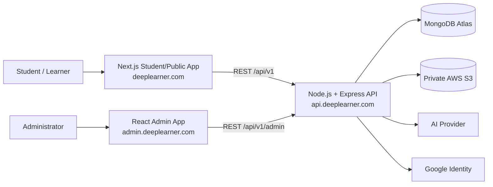

# DeepLearner System Architecture

**Version:** 1.0  
**Status:** Architecture baseline for implementation  
**Parent document:** DeepLearner PRD v1.0  
**Database detail:** Deliberately deferred to the next Database Architecture document

---

## 1. Purpose

This document defines the system-level architecture for **DeepLearner**, a visual-first technical learning platform for engineering/IT students and working professionals. It translates the approved PRD into an implementation architecture covering application topology, frontend and backend responsibilities, REST APIs, authentication, authorization, AI integration, visualization, code execution boundaries, media storage, security, deployment, observability, performance, and future scalability.

Detailed MongoDB collection design, embedding vs. referencing decisions, indexes, and progress/practice schemas are intentionally deferred to the next **Database Architecture** design phase.

## 2. Architecture Goals

1. Keep the first production architecture simple enough for a small team and approximately 1,000 initial users.
2. Preserve strong module boundaries so the monolith does not become a tightly coupled codebase.
3. Optimize public learning pages for SEO and fast discovery.
4. Keep the Admin application independent from public/student concerns.
5. Use a single backend API for Student and Admin clients.
6. Keep AI provider credentials and logic exclusively on the backend.
7. Make visual learning a first-class subsystem rather than embedding arbitrary generated UI code in content.
8. Protect student data, AI spending, and administrative workflows from abuse.
9. Keep infrastructure inexpensive during development while retaining a clear production migration path.
10. Avoid microservices, Redis, queues, and distributed infrastructure until an actual scaling or reliability need appears.

## 3. Architecture Principles

- **Modular monolith over microservices.** One Node.js backend deployment with clear domain modules.
- **API-first integration.** Next.js Student/Public and React Admin clients consume versioned REST APIs.
- **Backend authorization is authoritative.** UI visibility is not treated as a security boundary.
- **Provider abstraction.** AI, media, email, and identity integrations are isolated behind adapters.
- **Validated structured data.** API payloads and AI structured outputs are validated before entering business workflows.
- **Secure by default.** Secrets never reach browsers; sensitive routes are authenticated, authorized, validated, and rate limited.
- **Progressive complexity.** No Redis, workers, queues, or microservices in V1 unless a measured need emerges.
- **Public SEO, private operations.** Student/public experience uses Next.js; Admin remains a private React SPA.

## 4. Locked Technology Decisions

| Area | Decision |
|---|---|
| Repository | One GitHub monorepo |
| Package manager | npm with npm workspaces |
| Student/Public application | Next.js + TypeScript |
| Student/Public domain | `deeplearner.com` |
| Admin application | React + TypeScript + Vite |
| Admin domain | `admin.deeplearner.com` |
| Backend | Node.js + Express + TypeScript |
| API domain | `api.deeplearner.com` |
| Backend architecture | Modular monolith |
| API style | REST, versioned under `/api/v1` |
| Database | MongoDB Atlas managed cluster |
| ODM | Mongoose |
| Validation | Zod |
| Password hashing | Argon2id |
| Authentication | DeepLearner-managed email/password + Google OAuth/OIDC |
| Sessions | Short-lived access token + HttpOnly refresh-token cookie + MongoDB session record |
| Authorization | RBAC + feature entitlements |
| Media | Private AWS S3 bucket for images, SVGs, and GIFs |
| Visual diagrams | React Flow + SVG |
| Animation | Framer Motion |
| Advanced visualization | D3 only where required |
| Code editor | Monaco Editor |
| AI | Backend provider abstraction, Admin-only generation in V1 |
| Queue | None initially |
| Redis | None initially |
| Microservices | None initially |
| Video hosting | Not in V1 |

## 5. System Context



## 6. Application Topology

DeepLearner has **two frontend clients and one backend application**.

### 6.1 Student/Public Application

**Technology:** Next.js + TypeScript  
**Domain:** `deeplearner.com`

Responsibilities:

- Landing page and public marketing content
- SEO-friendly public lessons
- Registration and login experiences
- Student dashboard
- Learning paths
- Read / Visualize / Example / Practice / Revise experiences
- Interview preparation
- Notes, bookmarks, and highlights
- Progress and gamification UI
- JavaScript/TypeScript playground

Next.js is used because the public-learning side benefits from server rendering/static generation, metadata control, public route discoverability, and SEO.

### 6.2 Admin Application

**Technology:** React + TypeScript + Vite  
**Domain:** `admin.deeplearner.com`

Responsibilities:

- Admin dashboard
- Content authoring
- AI draft generation
- Review / approval / publish workflows
- Learning-path management
- Interview-question management
- Visualization selection and preview
- Student/account operations
- Aggregate analytics
- Content-quality alerts
- Reported-content review
- Audit-log viewing

The Admin application is intentionally separate because it does not require SEO or public rendering and can evolve independently as a dashboard-heavy SPA.

### 6.3 Shared Backend

**Technology:** Node.js + Express + TypeScript  
**Domain:** `api.deeplearner.com`

The backend is the authoritative source for:

- Authentication and sessions
- Authorization
- Business rules
- Content workflow
- Progress calculations
- Practice attempts
- AI generation
- Media authorization
- Analytics ingestion
- Audit logging
- Database access

Both Student and Admin applications call the same backend.

## 7. Monorepo Structure

```text
deeplearner/
├── apps/
│   ├── web/                 # Next.js student/public app
│   ├── admin/               # React + Vite admin app
│   └── api/                 # Node.js + Express API
│
├── packages/
│   ├── shared-types/        # Shared TypeScript contracts
│   ├── validation/          # Reusable Zod schemas where appropriate
│   └── config/              # Shared non-secret configuration helpers
│
├── package.json             # npm workspaces
├── .gitignore
├── .env.example
└── README.md
```

The repository is one unit of source control, but each application can be deployed independently.

## 8. Backend Modular-Monolith Design

The Node.js API remains one deployable application but is split by business capability.

Recommended modules:

```text
auth/
users/
technologies/
learning-paths/
content/
visualizations/
practice/
progress/
interview/
notes/
bookmarks/
highlights/
gamification/
notifications/
search/
ai/
media/
analytics/
content-reports/
subscriptions/
audit/
```

### 8.1 Layering

```text
HTTP Request
    ↓
Route / Controller
    ↓
Middleware
  - authentication
  - authorization
  - validation
  - rate limiting
  - request correlation
    ↓
Application / Domain Service
    ↓
Repository / Persistence Boundary
    ↓
MongoDB Atlas / External Adapter
```

**Controllers** translate HTTP to application requests.  
**Services** own business rules and workflows.  
**Repositories** isolate Mongoose/database access.  
**Adapters** isolate third-party providers such as S3, Google, and AI.

No route should directly implement substantial business logic or call Mongoose models across unrelated modules.

## 9. REST API Design

Base path:

```text
/api/v1
```

Representative Student routes:

```text
GET    /api/v1/technologies
GET    /api/v1/learning-paths/:id
GET    /api/v1/concepts/:id
POST   /api/v1/practice/:questionId/attempt
GET    /api/v1/progress
POST   /api/v1/bookmarks
POST   /api/v1/notes
POST   /api/v1/content-reports
```

Representative Admin routes:

```text
GET    /api/v1/admin/dashboard
POST   /api/v1/admin/concepts
PUT    /api/v1/admin/concepts/:id
POST   /api/v1/admin/concepts/:id/approve
POST   /api/v1/admin/concepts/:id/publish
POST   /api/v1/admin/ai/generate
GET    /api/v1/admin/analytics
GET    /api/v1/admin/reports
```

### API conventions

- JSON request/response payloads
- Resource-oriented URLs
- Explicit HTTP status codes
- Pagination for list endpoints
- Versioning under `/api/v1`
- Consistent error envelope
- Server-generated request/correlation ID
- Zod validation on all untrusted payloads
- Backend validation remains authoritative even if clients share schemas

Example error envelope:

```json
{
  "error": {
    "code": "VALIDATION_ERROR",
    "message": "Request validation failed",
    "requestId": "...",
    "details": []
  }
}
```

## 10. Authentication Architecture

DeepLearner owns its authentication and session model.

### 10.1 Email/Password

1. User submits email/password over HTTPS.
2. Backend validates the payload.
3. Password is verified using Argon2id.
4. Backend creates/rotates a server-side session record.
5. Backend issues a short-lived access token.
6. Backend sets a Secure, HttpOnly refresh-token cookie.
7. Client uses the access token for protected API calls.
8. When the access token expires, the refresh flow validates the refresh cookie and server-side session before issuing a new access token.

### 10.2 Google Login

Google OAuth/OIDC is integrated through an audited/supported library. DeepLearner does not invent its own OAuth protocol implementation.

1. User chooses Continue with Google.
2. Google authenticates the user.
3. Backend validates the Google identity result.
4. DeepLearner finds or creates its own user.
5. DeepLearner creates its own session and token set.

Google establishes identity; DeepLearner remains responsible for application authorization and sessions.

### 10.3 Session Model

Refresh tokens are not treated as permanently valid bearer strings. A server-side session record enables:

- Logout
- Session revocation
- Token rotation
- Password-change invalidation
- Future logout-all-devices functionality

Detailed session collection fields are deferred to Database Architecture.

## 11. Authorization and Entitlements

Two different concepts are maintained:

- **Role**: what administrative authority a user has (`STUDENT`, `ADMIN`)
- **Entitlement**: what product features a plan grants

Example:

```text
Role: STUDENT
Plan: PREMIUM
Entitlements:
  - visual_learning
  - advanced_practice
  - interview_module
  - code_visualizer
```

Admin endpoints require backend checks such as:

```text
authenticate
    ↓
requireRole("ADMIN")
    ↓
controller
```

The Admin UI hiding buttons is not considered a security control.

During development, all users may be granted premium entitlements while the entitlement engine remains active.

## 12. Content Lifecycle Architecture

Content follows a controlled workflow:

```text
DRAFT
  ↓
AI_GENERATED (when AI is used)
  ↓
IN_REVIEW
  ↓
APPROVED
  ↓
PUBLISHED
  ↓
ARCHIVED
```

Additional state:

```text
CHANGES_REQUIRED
```

Important invariant:

> No AI operation may directly publish content.

Only `PUBLISHED` content is visible to students.

## 13. AI Architecture

AI is an **Admin-side content-assistance capability** in V1.

### 13.1 Provider abstraction

Business modules call an internal AI service rather than directly calling a vendor SDK.

```text
Content Service
      ↓
AI Service
      ↓
AI Provider Adapter
      ↓
OpenAI / future provider
```

Representative operations:

```text
generateReadExplanation()
suggestVisualization()
generateExamples()
generatePracticeQuestions()
generateRevisionMaterial()
generateFlashcards()
generateInterviewQuestions()
```

### 13.2 Structured output

Where AI produces machine-consumed data, the output must be parsed and validated before storage.

```text
AI Provider
    ↓
Structured response
    ↓
Zod validation
    ↓
Accepted draft OR rejected/regenerated result
```

### 13.3 AI security and cost controls

- AI keys exist only in backend secrets
- Admin authentication required
- `ADMIN` role required
- Per-route rate limits
- Daily/internal usage quotas
- Server-side model selection
- Output/token limits
- Separate DEV and PROD keys/projects
- Usage and estimated-cost logging
- No secret values in logs
- Human approval before publication

No student-facing live AI tutor exists in V1.

## 14. Visualization Engine Architecture

Visual learning is implemented as structured data plus trusted renderers.

```text
Concept
   ↓
Visualization reference/specification
   ↓
Validated visualization JSON
   ↓
Renderer Registry
   ├── Flow / Architecture Renderer
   ├── Mind Map Renderer
   ├── Timeline Renderer
   ├── Sequence Renderer
   ├── Execution Renderer
   └── Chart / Data Renderer
   ↓
Playback Controller
```

Core technology:

- React Flow for node/edge and architecture-style diagrams
- SVG for custom diagrams and execution visualizations
- Framer Motion for motion/step transitions
- D3 only for visualizations that genuinely require it

### 14.1 Security principle

AI does **not** generate arbitrary React/JavaScript and send it to students for execution.

Instead, AI may suggest validated structured visualization data that is rendered by DeepLearner-owned components.

### 14.2 Playback controls

Where supported:

- Play
- Pause
- Previous Step
- Next Step
- Replay
- Speed

Reduced-motion and non-animated fallbacks should remain possible.

## 15. Code Visualizer and Playground

### 15.1 Editor

The student playground uses Monaco Editor for JavaScript and TypeScript authoring.

### 15.2 Execution boundary

Arbitrary student code must **not** execute directly inside the production Node.js API process.

For V1, prefer browser-side/sandboxed execution for supported JavaScript/TypeScript use cases.

### 15.3 Code Visualizer

The Code Visualizer is conceptually separate from the raw editor. It can present controlled representations such as:

- Execution contexts
- Scope chains
- Closures
- Call stack
- Event-loop movement
- Promise lifecycle
- Variable state changes

A future secure server-side execution service, if required, should be designed separately and isolated from the main API.

## 16. Media Architecture

Supported V1 media:

- Images
- SVG
- GIF

Video hosting is excluded.

### 16.1 Storage

Files live in a private AWS S3 bucket. MongoDB stores metadata and object keys rather than file binaries.

### 16.2 Upload flow

1. Admin authenticates to DeepLearner API.
2. Admin requests an upload authorization.
3. Backend validates role, media type, and size constraints.
4. Backend returns a short-lived presigned S3 upload URL.
5. Browser uploads directly to S3.
6. DeepLearner stores media metadata in MongoDB.

Permanent AWS credentials never reach either frontend.

### 16.3 Delivery

During development, controlled S3 delivery is sufficient. A CDN such as CloudFront can be introduced later when traffic, latency, or caching needs justify it.

## 17. Data Persistence - High Level Only

DeepLearner uses a managed MongoDB Atlas cluster accessed through Mongoose repositories.

At this architecture level, data domains include:

- Identity and sessions
- Technologies and learning paths
- Modules/topics/concepts
- Visualizations
- Practice questions and attempts
- Student progress
- Notes/bookmarks/highlights
- Interview content
- Gamification
- Notifications
- AI usage
- Media metadata
- Content reports
- Audit events
- Plan/entitlement data

**This document intentionally does not decide:**

- exact collection boundaries
- embedded vs referenced documents
- indexes
- unique constraints
- schema field definitions
- progress aggregation strategy
- practice-attempt storage model
- visualization document granularity

Those are deferred to Database Architecture.

## 18. Analytics and Event Architecture

V1 should capture meaningful product events without introducing a separate analytics platform.

Representative events:

```text
user_registered
learning_path_started
concept_started
read_completed
visualization_started
visualization_completed
practice_submitted
answer_revealed
concept_completed
concept_revisited
bookmark_added
note_created
content_reported
badge_earned
```

Initial flow:

```text
Student/Admin action
      ↓
Backend business operation
      ↓
Analytics/Event service
      ↓
MongoDB persistence / aggregate computation
```

Events should not block critical user actions where avoidable. If event volume grows substantially, analytics can later move behind a queue or dedicated store.

## 19. Logging and Observability

V1 should use structured server logs.

Recommended fields:

```text
timestamp
level
requestId
module
action
userId (when safe/needed)
status
durationMs
```

Never log:

- Passwords
- Password hashes
- Full access/refresh tokens
- Google tokens
- AI API keys
- AWS secret keys
- Sensitive request bodies by default

Recommended V1 observability:

- Structured application logs
- Central error tracking
- Health endpoint
- Request latency
- AI usage metrics
- Authentication failure rates
- Content-publish failures
- S3 upload failures

## 20. Security Boundaries

### Internet-facing boundaries

- `deeplearner.com`
- `admin.deeplearner.com`
- `api.deeplearner.com`

### Critical controls

- HTTPS only
- Strict CORS allowlist for known frontend origins
- Secure headers
- API request-size limits
- Zod input validation
- Authentication rate limits
- Admin AI rate limits and quotas
- Backend RBAC
- HttpOnly refresh cookies
- Short-lived access tokens
- Argon2id password hashing
- Secret separation by environment
- Private S3 bucket
- Presigned uploads
- Sanitized error responses
- Audit logs for privileged actions

### Admin-specific controls

Admin authorization must be enforced on the API, not only on `admin.deeplearner.com`.

## 21. Caching and Performance

V1 avoids distributed cache infrastructure.

Recommended initial approach:

- Next.js rendering/cache capabilities for public content
- HTTP/browser caching for immutable assets
- S3 cache headers for media
- MongoDB indexes selected during Database Architecture
- Pagination for large lists
- Lazy loading for heavy visualization/editor libraries
- Route/code splitting
- Avoid loading Monaco, D3, or complex visualization code on pages that do not need them

Redis is explicitly deferred until a concrete use case appears.

## 22. Background Work

V1 does not require a queue/worker system.

Initial AI flow may remain synchronous for Admin content generation, with sensible timeouts and status handling.

A queue becomes appropriate when:

- AI generation jobs are long-running or concurrent
- media processing is introduced
- email volume grows
- analytics/event volume grows
- scheduled jobs become common

The backend module design should allow adding workers later without changing public API contracts.

## 23. Failure Handling

### API

- Consistent error envelope
- Correlation/request ID
- No internal stack traces exposed to clients
- Retry only idempotent operations where safe

### Authentication

- Invalid/expired access token -> unauthorized response
- Valid refresh session -> token refresh
- Revoked/expired refresh session -> reauthentication required

### AI

- Provider timeout/failure must not corrupt content state
- AI generation remains a draft operation
- Invalid structured output is rejected or regenerated
- Provider outage must not prevent students from reading already-published content

### S3

- Failed uploads must not create published media references
- Orphaned upload cleanup can be added later

### MongoDB

- Database failures should return controlled service errors
- Business operations requiring consistency should be designed carefully during Database Architecture

## 24. Environment Strategy

Logical environments:

```text
LOCAL
DEVELOPMENT
PRODUCTION
```

`STAGING` can be introduced before public production when release complexity warrants it.

Environment isolation:

- Separate MongoDB databases/clusters as appropriate
- Separate AI keys/projects
- Separate S3 prefixes/buckets or strong environment prefixes
- Separate Google OAuth configurations where needed
- Separate secrets

Local secrets belong in `.env` files excluded from Git. Hosted environments use provider secret/environment-variable management.

## 25. Deployment Architecture

### Development recommendation

```text
GitHub monorepo
  ├── apps/web   -> Next.js-friendly hosting (e.g. Vercel)
  ├── apps/admin -> static/React hosting (e.g. Vercel)
  └── apps/api   -> Node.js hosting suitable for Express

External managed services:
  MongoDB Atlas
  AWS S3
  AI Provider
  Google Identity
```

The architecture intentionally keeps the application portable. The backend can later move to AWS or another Node-compatible environment without rewriting the application domain model.

### Production evolution

Potential future path:

```text
DNS / Edge / WAF
      ↓
Student Next.js       Admin React
      \                 /
       \               /
         Node.js API
          /   |   \
   MongoDB   S3   AI Provider
```

CloudFront/WAF/centralized observability can be introduced when production traffic and risk justify them.

## 26. Scalability Strategy

For approximately 1,000 initial users, the modular monolith is expected to be sufficient.

Scale in this order:

1. Optimize queries and indexes.
2. Scale Node application instances vertically/horizontally as needed.
3. Introduce CDN/cache improvements.
4. Add queue/worker infrastructure for genuinely asynchronous workloads.
5. Separate high-load modules only when measured bottlenecks justify service extraction.

Potential future extraction candidates:

- AI generation worker/service
- analytics pipeline
- secure code execution service
- notification/email worker

Microservices are not a roadmap goal by themselves.

## 27. Key Tradeoffs

### Separate Next.js Student app and React Admin app

**Benefits:** SEO where needed, simpler Admin SPA, independent release/UI evolution.  
**Cost:** two frontend deployments and some shared-contract management.

### Separate Express backend instead of Next.js-only backend

**Benefits:** clean client-agnostic REST boundary, easier future mobile/PWA clients, central Student/Admin business logic.  
**Cost:** one additional deployable application.

### Custom authentication

**Benefits:** control of user/session model and no hosted-auth dependency.  
**Cost:** more security responsibility, testing, token lifecycle management, and email flows.

### MongoDB Atlas

**Benefits:** managed operations and good fit for flexible content structures.  
**Cost:** schema discipline and relationship modeling must be intentionally designed.

### No queue/Redis in V1

**Benefits:** simpler deployment and debugging.  
**Cost:** long-running operations may need redesign later.

## 28. Architecture Decision Records (ADRs)

### ADR-001 - Modular Monolithic Backend

**Decision:** One Node.js/Express backend with internal modules.  
**Reason:** Current team/scale does not justify microservice operational complexity.  
**Future trigger:** Extract only measured bottlenecks or isolation-sensitive workloads.

### ADR-002 - Next.js for Student/Public Application

**Decision:** Next.js + TypeScript.  
**Reason:** Public learning pages need SEO, metadata, and rendering flexibility.

### ADR-003 - React SPA for Admin

**Decision:** React + TypeScript + Vite.  
**Reason:** Admin is private, dashboard/form-heavy, and does not require SSR/SEO.

### ADR-004 - Shared REST Backend

**Decision:** Student and Admin use the same versioned API.  
**Reason:** Single source of business truth and authorization.

### ADR-005 - DeepLearner-managed Authentication

**Decision:** Custom email/password/session model; Google used only as an identity provider.  
**Reason:** Product controls session and authorization behavior.

### ADR-006 - MongoDB Atlas + Mongoose

**Decision:** Managed MongoDB cluster with Mongoose data access.  
**Reason:** Operational simplicity and document-oriented content fit.

### ADR-007 - Private S3 Media Storage

**Decision:** Images/SVG/GIF in private S3, uploaded through presigned URLs.  
**Reason:** Avoid application-server file streaming and credential exposure.

### ADR-008 - Structured Visualization Specs

**Decision:** Render trusted structured visualization data; never execute arbitrary AI-generated UI code.  
**Reason:** Security, consistency, editability, and renderer reuse.

### ADR-009 - AI as Admin Assistant in V1

**Decision:** AI generation is Admin-only and requires human approval.  
**Reason:** Content quality, cost control, and safety.

### ADR-010 - No Redis / Queue Initially

**Decision:** Keep V1 synchronous and infrastructure-light.  
**Reason:** Current traffic and workflows do not justify distributed infrastructure.

## 29. Deferred to Database Architecture

The next design document must explicitly decide:

1. Collection boundaries for technology, learning path, module, topic, concept, and visualization.
2. Embedded documents vs. references.
3. User and session collections.
4. Student-progress representation and update strategy.
5. Practice-question and practice-attempt modeling.
6. First/latest/best score representation.
7. Learning-path ordering and prerequisite relationships.
8. Visualization-spec storage and versioning strategy.
9. Notes/bookmarks/highlights ownership and indexes.
10. Interview-question structure.
11. Gamification/XP/badge persistence.
12. Notification persistence and read-state model.
13. Content-approval and audit data structures.
14. AI usage/cost records.
15. Media metadata model.
16. Aggregate analytics strategy.
17. Indexes, compound indexes, uniqueness, and TTL indexes.
18. Soft-delete/archive conventions.
19. Data-retention rules.
20. Transaction/consistency requirements for multi-document workflows.

## 30. Implementation Sequence

Recommended technical sequence after Database Architecture is approved:

1. Monorepo bootstrap and shared TypeScript/config packages.
2. Node/Express API skeleton and health endpoint.
3. MongoDB connection and repository conventions.
4. Authentication + sessions + Google login.
5. RBAC and entitlement middleware.
6. Core content hierarchy APIs.
7. Next.js public/student shell.
8. React Admin shell.
9. Content workflow and Admin authoring.
10. S3 upload flow.
11. Practice and progress.
12. Visualization engine.
13. AI draft generation and approval integration.
14. Interview module.
15. Gamification/notifications/analytics.
16. Security hardening, observability, and deployment readiness.

## 31. Architecture Baseline

The approved baseline is:

```text
Student/Public: Next.js + TypeScript
Admin:          React + TypeScript + Vite
Backend:        Node.js + Express + TypeScript
Architecture:   Modular Monolith
API:            REST /api/v1
Database:       MongoDB Atlas + Mongoose
Validation:     Zod
Auth:           DeepLearner-managed + Google OAuth/OIDC
Password:       Argon2id
Session:        Access token + HttpOnly refresh cookie + server-side session
Media:          Private AWS S3
AI:             Backend-only provider abstraction, Admin-only in V1
Visualization:  React Flow + SVG + Framer Motion (+ D3 only when needed)
Code editor:    Monaco
Repository:     GitHub monorepo + npm workspaces
Redis/Queue:    Not initially
```

This baseline is stable enough to proceed to **DeepLearner Database Architecture** without revisiting the major system boundaries unless new product requirements materially change them.
